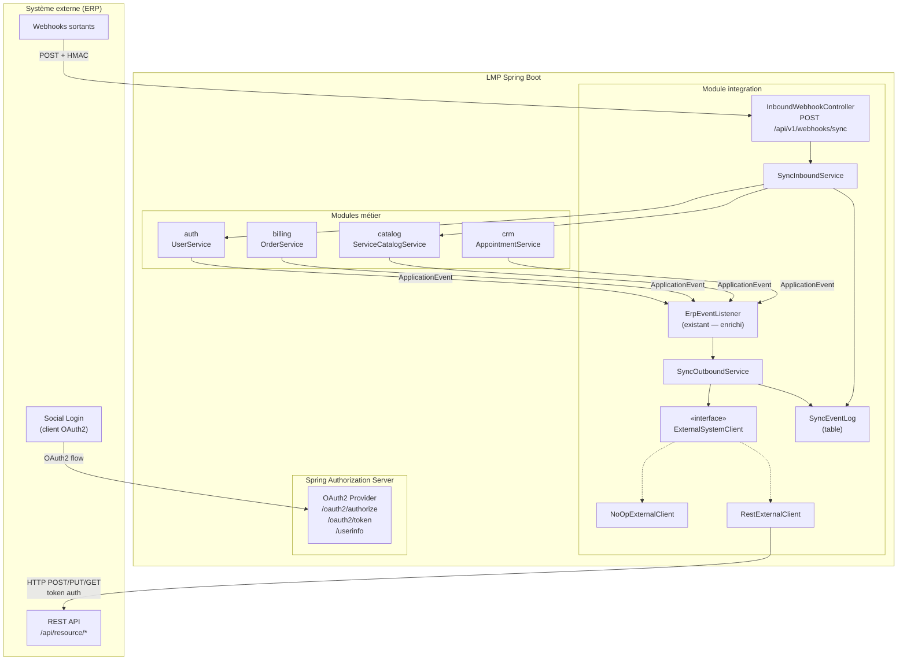
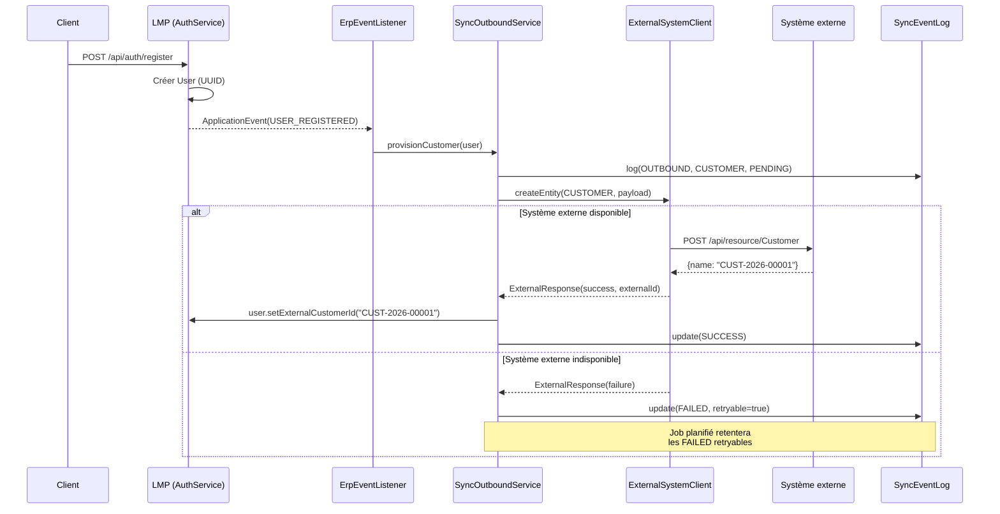
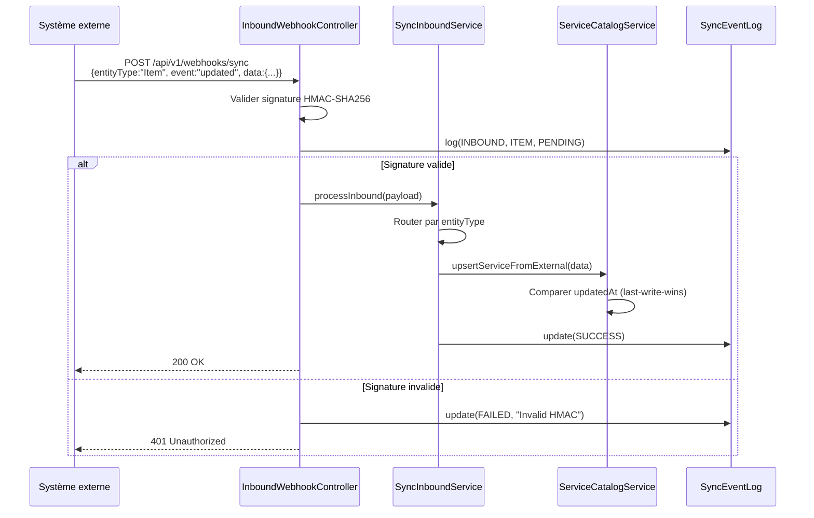
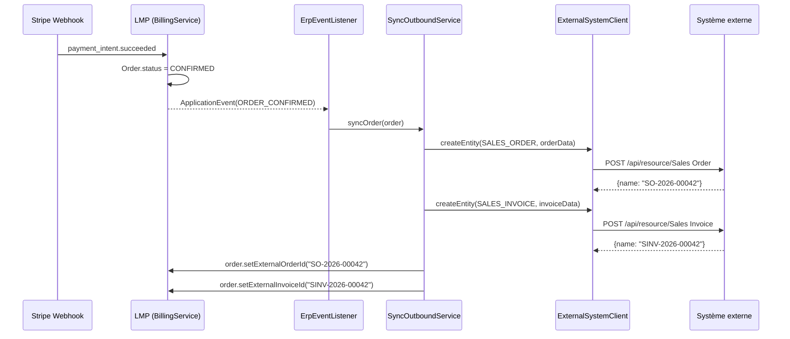
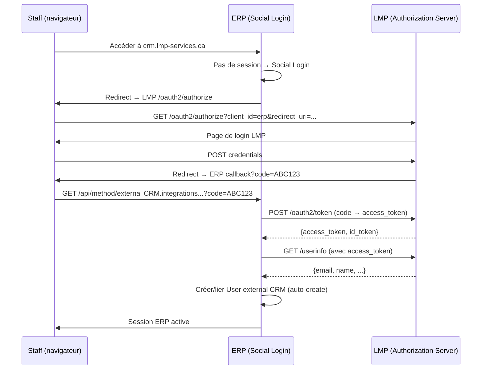

# ADR — Architecture d'intégration ERP-Agnostique (LMP Spring Boot)

> **Statut** : Approuvé  
> **Date** : 2026-04-19  
> **Auteur** : Architecture LMP  
> **Méthode** : BMAD — Phase 3 (Solutioning)  
> **Scope** : Spring Boot uniquement — le backend LMP ne connaît pas l'ERP cible

---

## 1. Contexte & Drivers

### 1.1 Situation actuelle

LMP Digital Services est un SaaS B2B/B2C (Spring Boot 3.5 + Angular) déployé sur Oracle Cloud via Dokploy. L'entreprise utilise external ERP (v17-develop) comme back-office interne (comptabilité, CRM, projets, support). Les deux systèmes fonctionnent en silos — aucune synchronisation automatique n'existe.

**Constat technique (19 avril 2026) :**

| Système | État |
|---|---|
| LMP — `LmpBusinessEvent` (20+ types) | ✅ Opérationnel, log-only via `ErpEventListener` |
| LMP — Spring Authorization Server (OAuth2) | ✅ Opérationnel |
| LMP — SSE notifications | ✅ Opérationnel |
| external ERP — Webhooks | ❌ 0 configuré |
| external ERP — Social Login Key | ❌ 0 configuré (pas de SSO) |
| external ERP — API Keys | ❌ Non générées |
| external ERP — Apps installées | external CRM, external ERP, crm (external CRM), lmp_branding, whitelabel |

### 1.2 Objectifs

1. **Synchroniser les données** entre LMP et l'ERP (utilisateurs, commandes, catalogue, projets, tickets)
2. **Zéro couplage** : aucune classe, import, ou chaîne de caractères référençant un ERP spécifique dans `src/main/java`
3. **Résilience** : LMP fonctionne seul si l'ERP est indisponible
4. **SSO unique** : LMP est le provider OAuth2, l'ERP est client

### 1.3 Contraintes

- Communication inter-modules via `ApplicationEvents` uniquement (Spring Modulith)
- Aucune FK cross-schema PostgreSQL
- UUID comme identifiants partout côté LMP
- L'ERP utilise des identifiants string (ex: `CUST-.YYYY.-XXXXX`)
- external CRM REST API : auth via `token api_key:api_secret`
- external CRM Webhooks : signature HMAC-SHA256 via `webhook_secret`

---

## 2. Décisions architecturales

### ADR-001 : Strategy Pattern pour le client externe

**Décision** : Utiliser une interface `ExternalSystemClient` avec des implémentations injectées via Spring `@Profile` ou `@ConditionalOnProperty`.

**Justification** : Permet de basculer entre un mode no-op (logs), un mode REST générique, ou tout autre adaptateur sans modifier le code métier. Le code ne référence jamais un ERP par son nom.

**Implémentations prévues :**

| Implémentation | Activation | Usage |
|---|---|---|
| `NoOpExternalClient` | `lmp.sync.enabled=false` (défaut) | Dev, tests, fallback |
| `RestExternalClient` | `lmp.sync.enabled=true` | Production — appels REST vers l'ERP |

### ADR-002 : Webhook inbound générique avec HMAC

**Décision** : Exposer un endpoint `POST /api/v1/webhooks/sync` qui accepte des payloads JSON génériques, validés par signature HMAC-SHA256.

**Justification** : L'ERP (quel qu'il soit) peut configurer ses webhooks vers cet endpoint. La validation HMAC garantit l'authenticité. Le routing est fait par `entityType` + `event` dans le payload, pas par des endpoints spécifiques.

### ADR-003 : SyncEventLog pour traçabilité et retry

**Décision** : Chaque événement de synchronisation (entrant ou sortant) est enregistré dans une table `sync_event_log` avec statut, payload, et compteur de retry.

**Justification** : Permet l'audit, le debugging, le retry automatique des échecs, et la réconciliation périodique.

### ADR-004 : Champs `external_*_id` sur les entités existantes

**Décision** : Ajouter des champs `external_customer_id`, `external_contact_id`, `external_order_id`, `external_invoice_id`, `external_item_code`, `external_group_id` sur les entités LMP existantes.

**Justification** : Établit le lien bidirectionnel entre les deux systèmes sans FK. Le nom `external_*` est volontairement générique (pas `erp_*`).

### ADR-005 : SSO — LMP provider, ERP client OAuth2

**Décision** : L'ERP est configuré comme client OAuth2 du Spring Authorization Server de LMP. L'auto-création d'utilisateurs est activée côté ERP.

**Justification** : Un seul point d'authentification. Le staff se connecte à l'ERP via LMP. Les clients ne voient jamais l'ERP.

### ADR-006 : Provisioning utilisateur double stratégie

**Décision** : Combiner l'auto-création SSO (pour le staff) et le provisioning API (pour les clients) pour s'assurer que chaque utilisateur LMP a un Customer correspondant côté ERP.

**Justification** : Le staff se connecte via SSO (auto-création User external CRM). Les clients ne se connectent jamais à l'ERP, donc leur Customer doit être créé via API quand ils s'inscrivent sur LMP.

### ADR-007 : Pas de Kafka — Spring Events + REST direct

**Décision** : Pour la Phase 1, rester sur Spring `ApplicationEvents` + appels REST synchrones (dans un thread async). Kafka sera évalué en Phase 5+ si les volumes le justifient.

**Justification** : L'infrastructure actuelle (Oracle A1 ARM, 24 Go RAM) est partagée. Kafka ajouterait de la complexité opérationnelle pour un volume de transactions initial faible. Le `SyncEventLog` joue le rôle de "outbox" pour les retries.

---

## 3. Diagrammes

### 3.1 Architecture des composants



### 3.2 Flux — Inscription client (provisioning)



### 3.3 Flux — Webhook entrant (mise à jour catalogue)



### 3.4 Flux — Commande payée (outbound)



### 3.5 Flux — SSO (staff → ERP via LMP)



---

## 4. Contrats Java

### 4.1 Interface ExternalSystemClient

```java
package com.lmp.integration.sync;

import java.time.Instant;
import java.util.List;
import java.util.Map;

/**
 * Client générique pour communiquer avec un système externe.
 * Aucune référence à un ERP spécifique — piloté par configuration.
 */
public interface ExternalSystemClient {

    /**
     * Vérifie si le système externe est accessible.
     */
    boolean isAvailable();

    /**
     * Crée une entité dans le système externe.
     */
    ExternalResponse createEntity(SyncEntityType type, Map<String, Object> data);

    /**
     * Met à jour une entité existante.
     */
    ExternalResponse updateEntity(SyncEntityType type, String externalId, Map<String, Object> data);

    /**
     * Récupère une entité par son ID externe.
     */
    ExternalResponse getEntity(SyncEntityType type, String externalId);

    /**
     * Liste les entités modifiées depuis un instant donné.
     */
    List<Map<String, Object>> listEntities(SyncEntityType type, Instant modifiedSince);
}
```

### 4.2 Enums

```java
package com.lmp.integration.sync;

/**
 * Types d'entités synchronisables. Noms volontairement génériques.
 */
public enum SyncEntityType {
    CUSTOMER,
    CONTACT,
    SALES_ORDER,
    SALES_INVOICE,
    PAYMENT,
    ITEM,
    ITEM_GROUP,
    ITEM_PRICE,
    PROJECT,
    TASK,
    ISSUE,
    COMMUNICATION,
    NOTIFICATION
}
```

```java
package com.lmp.integration.sync;

public enum SyncDirection {
    OUTBOUND,  // LMP → externe
    INBOUND    // externe → LMP
}
```

```java
package com.lmp.integration.sync;

public enum SyncStatus {
    PENDING,
    SUCCESS,
    FAILED,
    SKIPPED
}
```

### 4.3 ExternalResponse

```java
package com.lmp.integration.sync;

import java.util.Map;

/**
 * Réponse d'une opération sur le système externe.
 */
public record ExternalResponse(
        boolean success,
        String externalId,
        Map<String, Object> data,
        String errorMessage,
        int httpStatus
) {
    public static ExternalResponse success(String externalId, Map<String, Object> data) {
        return new ExternalResponse(true, externalId, data, null, 200);
    }

    public static ExternalResponse created(String externalId, Map<String, Object> data) {
        return new ExternalResponse(true, externalId, data, null, 201);
    }

    public static ExternalResponse failure(String errorMessage, int httpStatus) {
        return new ExternalResponse(false, null, null, errorMessage, httpStatus);
    }

    public static ExternalResponse unavailable() {
        return new ExternalResponse(false, null, null, "External system unavailable", 503);
    }
}
```

### 4.4 SyncEvent (entité JPA pour sync_event_log)

```java
package com.lmp.integration.sync.domain;

import com.lmp.integration.sync.SyncDirection;
import com.lmp.integration.sync.SyncEntityType;
import com.lmp.integration.sync.SyncStatus;
import jakarta.persistence.*;
import java.time.LocalDateTime;
import java.util.UUID;

@Entity
@Table(name = "sync_event_log")
public class SyncEvent {

    @Id
    @GeneratedValue(strategy = GenerationType.UUID)
    private UUID id;

    @Enumerated(EnumType.STRING)
    @Column(nullable = false, length = 10)
    private SyncDirection direction;

    @Enumerated(EnumType.STRING)
    @Column(name = "entity_type", nullable = false, length = 50)
    private SyncEntityType entityType;

    @Column(name = "local_entity_id")
    private UUID localEntityId;

    @Column(name = "external_entity_id", length = 140)
    private String externalEntityId;

    @Column(name = "event_type", nullable = false, length = 50)
    private String eventType; // CREATED, UPDATED, DELETED

    @Enumerated(EnumType.STRING)
    @Column(nullable = false, length = 20)
    private SyncStatus status = SyncStatus.PENDING;

    @Column(columnDefinition = "JSONB")
    private String payload;

    @Column(name = "error_message", columnDefinition = "TEXT")
    private String errorMessage;

    @Column(name = "retry_count")
    private Integer retryCount = 0;

    @Column(name = "created_at", nullable = false)
    private LocalDateTime createdAt = LocalDateTime.now();

    @Column(name = "processed_at")
    private LocalDateTime processedAt;

    // Getters, setters, builder pattern
}
```

### 4.5 NoOpExternalClient

```java
package com.lmp.integration.sync.client;

import com.lmp.integration.sync.*;
import org.slf4j.Logger;
import org.slf4j.LoggerFactory;
import org.springframework.boot.autoconfigure.condition.ConditionalOnProperty;
import org.springframework.stereotype.Component;
import java.time.Instant;
import java.util.*;

/**
 * Client no-op — log uniquement. Actif quand lmp.sync.enabled=false.
 */
@Component
@ConditionalOnProperty(name = "lmp.sync.enabled", havingValue = "false", matchIfMissing = true)
public class NoOpExternalClient implements ExternalSystemClient {

    private static final Logger log = LoggerFactory.getLogger(NoOpExternalClient.class);

    @Override
    public boolean isAvailable() {
        return false;
    }

    @Override
    public ExternalResponse createEntity(SyncEntityType type, Map<String, Object> data) {
        log.info("🔇 [SYNC NO-OP] createEntity({}) — data={}", type, data);
        return ExternalResponse.unavailable();
    }

    @Override
    public ExternalResponse updateEntity(SyncEntityType type, String externalId, Map<String, Object> data) {
        log.info("🔇 [SYNC NO-OP] updateEntity({}, {}) — data={}", type, externalId, data);
        return ExternalResponse.unavailable();
    }

    @Override
    public ExternalResponse getEntity(SyncEntityType type, String externalId) {
        log.info("🔇 [SYNC NO-OP] getEntity({}, {})", type, externalId);
        return ExternalResponse.unavailable();
    }

    @Override
    public List<Map<String, Object>> listEntities(SyncEntityType type, Instant modifiedSince) {
        log.info("🔇 [SYNC NO-OP] listEntities({}, since={})", type, modifiedSince);
        return List.of();
    }
}
```

### 4.6 RestExternalClient (implémentation production)

```java
package com.lmp.integration.sync.client;

import com.lmp.integration.sync.*;
import org.slf4j.Logger;
import org.slf4j.LoggerFactory;
import org.springframework.boot.autoconfigure.condition.ConditionalOnProperty;
import org.springframework.http.*;
import org.springframework.stereotype.Component;
import org.springframework.web.client.RestClient;
import java.time.Instant;
import java.util.*;

/**
 * Client REST générique — appelle un système externe via son API REST.
 * Configuration via application.properties (pas de nom d'ERP en dur).
 */
@Component
@ConditionalOnProperty(name = "lmp.sync.enabled", havingValue = "true")
public class RestExternalClient implements ExternalSystemClient {

    private static final Logger log = LoggerFactory.getLogger(RestExternalClient.class);

    private final RestClient restClient;
    private final SyncProperties syncProperties;
    private final EntityTypeMapping entityTypeMapping;

    public RestExternalClient(SyncProperties syncProperties, EntityTypeMapping entityTypeMapping) {
        this.syncProperties = syncProperties;
        this.entityTypeMapping = entityTypeMapping;
        this.restClient = RestClient.builder()
                .baseUrl(syncProperties.getExternal().getBaseUrl())
                .defaultHeader("Authorization",
                        "token " + syncProperties.getExternal().getApiKey()
                                + ":" + syncProperties.getExternal().getApiSecret())
                .defaultHeader("Content-Type", "application/json")
                .build();
    }

    @Override
    public boolean isAvailable() {
        try {
            restClient.get()
                    .uri("/api/method/external CRM.auth.get_logged_user")
                    .retrieve()
                    .toBodilessEntity();
            return true;
        } catch (Exception e) {
            log.warn("🔴 [SYNC] External system unavailable: {}", e.getMessage());
            return false;
        }
    }

    @Override
    public ExternalResponse createEntity(SyncEntityType type, Map<String, Object> data) {
        String docType = entityTypeMapping.toExternalDocType(type);
        try {
            var response = restClient.post()
                    .uri("/api/resource/{docType}", docType)
                    .body(data)
                    .retrieve()
                    .body(Map.class);

            String externalId = extractId(response);
            log.info("✅ [SYNC] Created {} → externalId={}", type, externalId);
            return ExternalResponse.created(externalId, response);
        } catch (Exception e) {
            log.error("❌ [SYNC] Failed to create {}: {}", type, e.getMessage());
            return ExternalResponse.failure(e.getMessage(), 500);
        }
    }

    @Override
    public ExternalResponse updateEntity(SyncEntityType type, String externalId, Map<String, Object> data) {
        String docType = entityTypeMapping.toExternalDocType(type);
        try {
            var response = restClient.put()
                    .uri("/api/resource/{docType}/{name}", docType, externalId)
                    .body(data)
                    .retrieve()
                    .body(Map.class);

            log.info("✅ [SYNC] Updated {} {} ", type, externalId);
            return ExternalResponse.success(externalId, response);
        } catch (Exception e) {
            log.error("❌ [SYNC] Failed to update {} {}: {}", type, externalId, e.getMessage());
            return ExternalResponse.failure(e.getMessage(), 500);
        }
    }

    @Override
    public ExternalResponse getEntity(SyncEntityType type, String externalId) {
        String docType = entityTypeMapping.toExternalDocType(type);
        try {
            var response = restClient.get()
                    .uri("/api/resource/{docType}/{name}", docType, externalId)
                    .retrieve()
                    .body(Map.class);

            return ExternalResponse.success(externalId, response);
        } catch (Exception e) {
            return ExternalResponse.failure(e.getMessage(), 500);
        }
    }

    @Override
    public List<Map<String, Object>> listEntities(SyncEntityType type, Instant modifiedSince) {
        String docType = entityTypeMapping.toExternalDocType(type);
        try {
            var response = restClient.get()
                    .uri(uri -> uri
                            .path("/api/resource/{docType}")
                            .queryParam("filters", "[[\"modified\",\">=\",\"" + modifiedSince + "\"]]")
                            .queryParam("limit_page_length", 100)
                            .build(docType))
                    .retrieve()
                    .body(Map.class);

            return (List<Map<String, Object>>) response.getOrDefault("data", List.of());
        } catch (Exception e) {
            log.error("❌ [SYNC] Failed to list {}: {}", type, e.getMessage());
            return List.of();
        }
    }

    @SuppressWarnings("unchecked")
    private String extractId(Map<String, Object> response) {
        if (response == null) return null;
        var data = (Map<String, Object>) response.get("data");
        return data != null ? (String) data.get("name") : null;
    }
}
```

### 4.7 EntityTypeMapping (configurable)

```java
package com.lmp.integration.sync.client;

import com.lmp.integration.sync.SyncEntityType;
import org.springframework.stereotype.Component;
import java.util.Map;

/**
 * Mapping entre les types d'entités LMP et les noms de documents du système externe.
 * Ce mapping est le SEUL endroit où les noms du système externe apparaissent.
 * En production, ces valeurs viennent de la configuration.
 */
@Component
public class EntityTypeMapping {

    private static final Map<SyncEntityType, String> DEFAULT_MAPPING = Map.ofEntries(
            Map.entry(SyncEntityType.CUSTOMER, "Customer"),
            Map.entry(SyncEntityType.CONTACT, "Contact"),
            Map.entry(SyncEntityType.SALES_ORDER, "Sales Order"),
            Map.entry(SyncEntityType.SALES_INVOICE, "Sales Invoice"),
            Map.entry(SyncEntityType.PAYMENT, "Payment Entry"),
            Map.entry(SyncEntityType.ITEM, "Item"),
            Map.entry(SyncEntityType.ITEM_GROUP, "Item Group"),
            Map.entry(SyncEntityType.ITEM_PRICE, "Item Price"),
            Map.entry(SyncEntityType.PROJECT, "Project"),
            Map.entry(SyncEntityType.TASK, "Task"),
            Map.entry(SyncEntityType.ISSUE, "Issue"),
            Map.entry(SyncEntityType.COMMUNICATION, "Communication"),
            Map.entry(SyncEntityType.NOTIFICATION, "Notification Log")
    );

    public String toExternalDocType(SyncEntityType type) {
        return DEFAULT_MAPPING.getOrDefault(type, type.name());
    }

    public SyncEntityType fromExternalDocType(String docType) {
        return DEFAULT_MAPPING.entrySet().stream()
                .filter(e -> e.getValue().equals(docType))
                .map(Map.Entry::getKey)
                .findFirst()
                .orElse(null);
    }
}
```

### 4.8 SyncProperties (configuration)

```java
package com.lmp.integration.sync;

import org.springframework.boot.context.properties.ConfigurationProperties;

/**
 * Configuration de la synchronisation — application.properties
 *
 * lmp.sync.enabled=true
 * lmp.sync.external.base-url=https://crm.example.com
 * lmp.sync.external.api-key=${ERP_API_KEY}
 * lmp.sync.external.api-secret=${ERP_API_SECRET}
 * lmp.sync.webhook.hmac-secret=${WEBHOOK_HMAC_SECRET}
 * lmp.sync.features.user-provisioning=true
 * lmp.sync.features.catalog-sync=true
 * lmp.sync.features.order-sync=true
 * lmp.sync.retry.max-attempts=5
 * lmp.sync.retry.delay-seconds=60
 */
@ConfigurationProperties(prefix = "lmp.sync")
public class SyncProperties {

    private boolean enabled = false;
    private External external = new External();
    private Webhook webhook = new Webhook();
    private Features features = new Features();
    private Retry retry = new Retry();

    // -- Nested classes --

    public static class External {
        private String baseUrl;
        private String apiKey;
        private String apiSecret;
        // getters/setters
    }

    public static class Webhook {
        private String hmacSecret;
        // getters/setters
    }

    public static class Features {
        private boolean userProvisioning = true;
        private boolean catalogSync = true;
        private boolean orderSync = true;
        private boolean projectSync = false;
        private boolean ticketSync = false;
        // getters/setters
    }

    public static class Retry {
        private int maxAttempts = 5;
        private int delaySeconds = 60;
        // getters/setters
    }

    // getters/setters for top-level fields
}
```

### 4.9 SyncOutboundService

```java
package com.lmp.integration.sync.service;

import com.lmp.integration.sync.*;
import com.lmp.integration.sync.domain.SyncEvent;
import com.lmp.integration.sync.repository.SyncEventRepository;
import org.slf4j.Logger;
import org.slf4j.LoggerFactory;
import org.springframework.scheduling.annotation.Async;
import org.springframework.stereotype.Service;
import java.time.LocalDateTime;
import java.util.Map;
import java.util.UUID;

/**
 * Gère les événements sortants (LMP → système externe).
 * Appelé par ErpEventListener quand un événement métier doit être synchronisé.
 */
@Service
public class SyncOutboundService {

    private static final Logger log = LoggerFactory.getLogger(SyncOutboundService.class);

    private final ExternalSystemClient externalClient;
    private final SyncEventRepository syncEventRepository;
    private final SyncProperties syncProperties;

    // Constructor injection...

    @Async
    public void syncEntity(SyncEntityType entityType, String eventType, UUID localEntityId, Map<String, Object> data) {
        if (!syncProperties.isEnabled()) {
            log.debug("🔇 [SYNC] Synchronisation désactivée — événement ignoré");
            return;
        }

        SyncEvent syncEvent = new SyncEvent();
        syncEvent.setDirection(SyncDirection.OUTBOUND);
        syncEvent.setEntityType(entityType);
        syncEvent.setLocalEntityId(localEntityId);
        syncEvent.setEventType(eventType);
        syncEvent.setStatus(SyncStatus.PENDING);
        syncEvent.setPayload(serializePayload(data));
        syncEventRepository.save(syncEvent);

        try {
            ExternalResponse response = switch (eventType) {
                case "CREATED" -> externalClient.createEntity(entityType, data);
                case "UPDATED" -> {
                    String externalId = (String) data.remove("_externalId");
                    yield externalClient.updateEntity(entityType, externalId, data);
                }
                default -> {
                    log.warn("Unhandled event type: {}", eventType);
                    yield ExternalResponse.failure("Unknown event type", 400);
                }
            };

            if (response.success()) {
                syncEvent.setStatus(SyncStatus.SUCCESS);
                syncEvent.setExternalEntityId(response.externalId());
                syncEvent.setProcessedAt(LocalDateTime.now());
            } else {
                syncEvent.setStatus(SyncStatus.FAILED);
                syncEvent.setErrorMessage(response.errorMessage());
                syncEvent.setRetryCount(syncEvent.getRetryCount() + 1);
            }
        } catch (Exception e) {
            syncEvent.setStatus(SyncStatus.FAILED);
            syncEvent.setErrorMessage(e.getMessage());
            syncEvent.setRetryCount(syncEvent.getRetryCount() + 1);
            log.error("❌ [SYNC] Exception during outbound sync: {}", e.getMessage(), e);
        }

        syncEventRepository.save(syncEvent);
    }
}
```

### 4.10 SyncInboundService

```java
package com.lmp.integration.sync.service;

import com.lmp.integration.sync.*;
import com.lmp.integration.sync.client.EntityTypeMapping;
import com.lmp.integration.sync.domain.SyncEvent;
import com.lmp.integration.sync.repository.SyncEventRepository;
import org.slf4j.Logger;
import org.slf4j.LoggerFactory;
import org.springframework.stereotype.Service;
import java.time.LocalDateTime;
import java.util.Map;

/**
 * Gère les événements entrants (système externe → LMP).
 * Appelé par InboundWebhookController après validation HMAC.
 */
@Service
public class SyncInboundService {

    private static final Logger log = LoggerFactory.getLogger(SyncInboundService.class);

    private final SyncEventRepository syncEventRepository;
    private final EntityTypeMapping entityTypeMapping;
    // Inject domain services: UserService, ServiceCatalogService, etc.

    public void processInbound(InboundSyncPayload payload) {
        SyncEntityType entityType = entityTypeMapping.fromExternalDocType(payload.entityType());
        if (entityType == null) {
            log.warn("⚠️ [SYNC INBOUND] Unknown entity type: {}", payload.entityType());
            return;
        }

        SyncEvent syncEvent = new SyncEvent();
        syncEvent.setDirection(SyncDirection.INBOUND);
        syncEvent.setEntityType(entityType);
        syncEvent.setExternalEntityId(payload.entityId());
        syncEvent.setEventType(payload.event());
        syncEvent.setStatus(SyncStatus.PENDING);
        syncEventRepository.save(syncEvent);

        try {
            switch (entityType) {
                case ITEM -> handleItemSync(payload);
                case ITEM_GROUP -> handleItemGroupSync(payload);
                case CUSTOMER -> handleCustomerSync(payload);
                case PROJECT -> handleProjectSync(payload);
                case TASK -> handleTaskSync(payload);
                case ISSUE -> handleIssueSync(payload);
                case COMMUNICATION -> handleCommunicationSync(payload);
                default -> log.info("📥 [SYNC INBOUND] Entity type {} not yet handled", entityType);
            }

            syncEvent.setStatus(SyncStatus.SUCCESS);
            syncEvent.setProcessedAt(LocalDateTime.now());
        } catch (Exception e) {
            syncEvent.setStatus(SyncStatus.FAILED);
            syncEvent.setErrorMessage(e.getMessage());
            log.error("❌ [SYNC INBOUND] Failed: {}", e.getMessage(), e);
        }

        syncEventRepository.save(syncEvent);
    }

    // Private handlers delegate to domain services...
}
```

### 4.11 InboundWebhookController

```java
package com.lmp.integration.sync.web;

import com.lmp.integration.sync.SyncProperties;
import com.lmp.integration.sync.service.SyncInboundService;
import org.slf4j.Logger;
import org.slf4j.LoggerFactory;
import org.springframework.http.ResponseEntity;
import org.springframework.web.bind.annotation.*;
import javax.crypto.Mac;
import javax.crypto.spec.SecretKeySpec;
import java.nio.charset.StandardCharsets;
import java.util.HexFormat;
import java.util.Map;

/**
 * Endpoint générique pour recevoir les webhooks du système externe.
 * Validation HMAC-SHA256 obligatoire.
 *
 * POST /api/v1/webhooks/sync
 */
@RestController
@RequestMapping("/api/v1/webhooks/sync")
public class InboundWebhookController {

    private static final Logger log = LoggerFactory.getLogger(InboundWebhookController.class);

    private final SyncInboundService syncInboundService;
    private final SyncProperties syncProperties;

    @PostMapping
    public ResponseEntity<Map<String, String>> receiveWebhook(
            @RequestHeader(value = "X-Webhook-Signature", required = false) String signature,
            @RequestBody String rawBody,
            @RequestBody InboundSyncPayload payload) {

        // Validate HMAC
        if (!validateHmac(rawBody, signature)) {
            log.warn("🔴 [WEBHOOK] Invalid HMAC signature");
            return ResponseEntity.status(401).body(Map.of("error", "Invalid signature"));
        }

        log.info("📥 [WEBHOOK] Received: entityType={}, event={}, entityId={}",
                payload.entityType(), payload.event(), payload.entityId());

        syncInboundService.processInbound(payload);

        return ResponseEntity.ok(Map.of("status", "accepted"));
    }

    private boolean validateHmac(String body, String receivedSignature) {
        if (receivedSignature == null || receivedSignature.isBlank()) return false;
        try {
            String secret = syncProperties.getWebhook().getHmacSecret();
            Mac mac = Mac.getInstance("HmacSHA256");
            mac.init(new SecretKeySpec(secret.getBytes(StandardCharsets.UTF_8), "HmacSHA256"));
            byte[] hash = mac.doFinal(body.getBytes(StandardCharsets.UTF_8));
            String expected = HexFormat.of().formatHex(hash);
            return expected.equalsIgnoreCase(receivedSignature);
        } catch (Exception e) {
            log.error("HMAC validation error: {}", e.getMessage());
            return false;
        }
    }
}
```

### 4.12 InboundSyncPayload

```java
package com.lmp.integration.sync;

import java.util.Map;

/**
 * Payload reçu d'un webhook du système externe.
 * Structure générique — pas de référence à un ERP.
 */
public record InboundSyncPayload(
        String entityType,
        String entityId,
        String event,
        Map<String, Object> data
) {}
```

### 4.13 SyncRetryScheduler

```java
package com.lmp.integration.sync.service;

import com.lmp.integration.sync.*;
import com.lmp.integration.sync.domain.SyncEvent;
import com.lmp.integration.sync.repository.SyncEventRepository;
import org.slf4j.Logger;
import org.slf4j.LoggerFactory;
import org.springframework.scheduling.annotation.Scheduled;
import org.springframework.stereotype.Component;
import java.util.List;

/**
 * Job planifié qui retente les synchronisations échouées.
 */
@Component
public class SyncRetryScheduler {

    private static final Logger log = LoggerFactory.getLogger(SyncRetryScheduler.class);

    private final SyncEventRepository syncEventRepository;
    private final ExternalSystemClient externalClient;
    private final SyncProperties syncProperties;

    @Scheduled(fixedDelayString = "${lmp.sync.retry.delay-seconds:60}000")
    public void retryFailedEvents() {
        if (!syncProperties.isEnabled()) return;
        if (!externalClient.isAvailable()) {
            log.debug("🔇 [RETRY] External system unavailable — skipping retry cycle");
            return;
        }

        List<SyncEvent> failedEvents = syncEventRepository
                .findByStatusAndDirectionAndRetryCountLessThan(
                        SyncStatus.FAILED,
                        SyncDirection.OUTBOUND,
                        syncProperties.getRetry().getMaxAttempts()
                );

        log.info("🔄 [RETRY] {} failed events to retry", failedEvents.size());
        // Retry logic — delegate to SyncOutboundService
    }
}
```

---

## 5. Migrations Flyway

### 5.1 Ajout des champs `external_*_id` sur les entités existantes

```sql
-- V300__add_external_sync_fields.sql
-- Ajout des champs de liaison vers le système externe (agnostique)

ALTER TABLE users ADD COLUMN IF NOT EXISTS external_customer_id VARCHAR(140);
ALTER TABLE users ADD COLUMN IF NOT EXISTS external_contact_id VARCHAR(140);

ALTER TABLE orders ADD COLUMN IF NOT EXISTS external_order_id VARCHAR(140);
ALTER TABLE orders ADD COLUMN IF NOT EXISTS external_invoice_id VARCHAR(140);

ALTER TABLE services ADD COLUMN IF NOT EXISTS external_item_code VARCHAR(140);

ALTER TABLE service_categories ADD COLUMN IF NOT EXISTS external_group_id VARCHAR(140);

-- Index pour les lookups par ID externe
CREATE INDEX IF NOT EXISTS idx_users_external_customer ON users(external_customer_id) WHERE external_customer_id IS NOT NULL;
CREATE INDEX IF NOT EXISTS idx_orders_external_order ON orders(external_order_id) WHERE external_order_id IS NOT NULL;
CREATE INDEX IF NOT EXISTS idx_services_external_item ON services(external_item_code) WHERE external_item_code IS NOT NULL;
```

### 5.2 Création de la table sync_event_log

```sql
-- V301__create_sync_event_log.sql
-- Journal de synchronisation pour audit, retry et réconciliation

CREATE TABLE sync_event_log (
    id                  UUID PRIMARY KEY DEFAULT gen_random_uuid(),
    direction           VARCHAR(10) NOT NULL CHECK (direction IN ('OUTBOUND', 'INBOUND')),
    entity_type         VARCHAR(50) NOT NULL,
    local_entity_id     UUID,
    external_entity_id  VARCHAR(140),
    event_type          VARCHAR(50) NOT NULL,
    status              VARCHAR(20) NOT NULL DEFAULT 'PENDING',
    payload             JSONB,
    error_message       TEXT,
    retry_count         INTEGER DEFAULT 0,
    created_at          TIMESTAMP NOT NULL DEFAULT NOW(),
    processed_at        TIMESTAMP
);

CREATE INDEX idx_sync_status_direction ON sync_event_log(status, direction);
CREATE INDEX idx_sync_entity ON sync_event_log(entity_type, local_entity_id);
CREATE INDEX idx_sync_created ON sync_event_log(created_at);
```

### 5.3 Création de la table external_system_config

```sql
-- V302__create_external_system_config.sql
-- Configuration du système externe (singleton-like, piloté par properties en priorité)

CREATE TABLE external_system_config (
    id              UUID PRIMARY KEY DEFAULT gen_random_uuid(),
    system_key      VARCHAR(50) UNIQUE NOT NULL,
    display_name    VARCHAR(100),
    base_url        VARCHAR(500),
    enabled         BOOLEAN DEFAULT false,
    sync_features   JSONB DEFAULT '{}',
    last_sync_at    TIMESTAMP,
    created_at      TIMESTAMP NOT NULL DEFAULT NOW(),
    updated_at      TIMESTAMP
);

-- Insérer la config par défaut
INSERT INTO external_system_config (system_key, display_name, enabled)
VALUES ('primary_erp', 'Système ERP principal', false);
```

---

## 6. Configuration requise (application.properties)

```properties
# ── Synchronisation ERP-agnostique ──────────────────────────────
# Désactivé par défaut — activer en staging/production
lmp.sync.enabled=false

# Système externe — URLs et credentials
lmp.sync.external.base-url=${EXTERNAL_SYSTEM_URL:http://localhost:8080}
lmp.sync.external.api-key=${EXTERNAL_SYSTEM_API_KEY:}
lmp.sync.external.api-secret=${EXTERNAL_SYSTEM_API_SECRET:}

# Webhook inbound — secret HMAC pour validation
lmp.sync.webhook.hmac-secret=${WEBHOOK_HMAC_SECRET:change-me-in-production}

# Feature flags — activer/désactiver par domaine
lmp.sync.features.user-provisioning=true
lmp.sync.features.catalog-sync=true
lmp.sync.features.order-sync=true
lmp.sync.features.project-sync=false
lmp.sync.features.ticket-sync=false

# Retry — paramètres de reprise
lmp.sync.retry.max-attempts=5
lmp.sync.retry.delay-seconds=60
```

---

## 7. Guide de configuration ERP (opérations)

> **Note** : Ce guide décrit les étapes à effectuer manuellement dans l'ERP. 
> Les noms de menus ci-dessous correspondent à la version actuelle de l'ERP déployé.

### 7.1 Créer les API Keys

1. Accéder à l'ERP → User List → sélectionner l'utilisateur admin
2. Onglet "Settings" → Section "API Access" → cliquer "Generate Keys"
3. Copier l'**API Key** et l'**API Secret** 
4. Stocker dans les variables d'environnement du déploiement LMP :
   - `EXTERNAL_SYSTEM_API_KEY=<api_key>`
   - `EXTERNAL_SYSTEM_API_SECRET=<api_secret>`

### 7.2 Configurer le SSO (Social Login Key)

1. Accéder à l'ERP → Social Login Key → Nouveau
2. Remplir :
   - **Provider Name** : `LMP`
   - **Client ID** : `<client_id du Spring Authorization Server>`
   - **Client Secret** : `<client_secret>`
   - **Authorize URL** : `https://dev.lmp-services.ca/oauth2/authorize`
   - **Access Token URL** : `https://dev.lmp-services.ca/oauth2/token`
   - **Redirect URL** : `https://crm.lmp-services.ca/api/method/external CRM.integrations.oauth2_logins.login_via_oauth2`
   - **API Endpoint** : `https://dev.lmp-services.ca/userinfo`
   - **Auth URL Data** : `{"response_type": "code", "scope": "openid profile email"}`
   - **Enable Social Login** : ✅
3. Sauvegarder

### 7.3 Configurer les Webhooks (ERP → LMP)

Pour chaque DocType à synchroniser, créer un Webhook dans l'ERP :

| DocType | Event | URL cible |
|---|---|---|
| Customer | on_update | `https://dev.lmp-services.ca/api/v1/webhooks/sync` |
| Item | on_update | `https://dev.lmp-services.ca/api/v1/webhooks/sync` |
| Item Group | on_update | `https://dev.lmp-services.ca/api/v1/webhooks/sync` |
| Project | on_update | `https://dev.lmp-services.ca/api/v1/webhooks/sync` |
| Task | on_update | `https://dev.lmp-services.ca/api/v1/webhooks/sync` |
| Issue | after_insert, on_update | `https://dev.lmp-services.ca/api/v1/webhooks/sync` |
| Communication | after_insert | `https://dev.lmp-services.ca/api/v1/webhooks/sync` |

Pour chaque webhook :
1. ERP → Webhook → Nouveau
2. **DocType** : (voir tableau)
3. **Doc Event** : (voir tableau)
4. **Request URL** : (voir tableau)
5. **Request Structure** : JSON
6. **Webhook Secret** : `<même valeur que WEBHOOK_HMAC_SECRET>`
7. **Webhook Headers** : `Content-Type: application/json`
8. **Webhook Data** : mapper les champs pertinents (name, modified, etc.)

### 7.4 Préparer les Tax Category (pour le reverse charge)

1. ERP → Tax Category → Nouveau
2. **Name** : `Autoliquidation UE`
3. Créer un **Sales Taxes and Charges Template** à 0% avec mention Art. 196
4. Créer une **Tax Rule** liant la Tax Category au template

---

## 8. Structure des fichiers (package `com.lmp.integration.sync`)

```
src/main/java/com/lmp/integration/sync/
├── ExternalSystemClient.java          # Interface — contrat principal
├── ExternalResponse.java              # Record — réponse d'opération
├── InboundSyncPayload.java            # Record — payload webhook entrant
├── SyncDirection.java                 # Enum — OUTBOUND/INBOUND
├── SyncEntityType.java                # Enum — CUSTOMER, ITEM, etc.
├── SyncProperties.java                # @ConfigurationProperties
├── SyncStatus.java                    # Enum — PENDING/SUCCESS/FAILED/SKIPPED
├── client/
│   ├── EntityTypeMapping.java         # Mapping SyncEntityType ↔ noms externes
│   ├── NoOpExternalClient.java        # Implémentation no-op (dev/test)
│   └── RestExternalClient.java        # Implémentation REST (production)
├── domain/
│   └── SyncEvent.java                 # Entité JPA — sync_event_log
├── repository/
│   └── SyncEventRepository.java       # Spring Data JPA
├── service/
│   ├── SyncOutboundService.java       # Événements sortants
│   ├── SyncInboundService.java        # Événements entrants
│   └── SyncRetryScheduler.java        # Job de retry planifié
└── web/
    └── InboundWebhookController.java  # POST /api/v1/webhooks/sync

src/main/resources/db/migration/
├── V300__add_external_sync_fields.sql
├── V301__create_sync_event_log.sql
└── V302__create_external_system_config.sql
```

---

## 9. Plan d'implémentation par phases

| Phase | Contenu Spring Boot | Config ERP (manuelle) | Critère de validation |
|---|---|---|---|
| **0 — Fondations** | Interfaces + enums + `SyncProperties` + `NoOpExternalClient` + `EntityTypeMapping` + migrations Flyway + `SyncEvent` JPA + repository | Rien | `mvn test` passe, migrations appliquées, `ErpEventListener` dispatch vers `SyncOutboundService` (no-op) |
| **1 — User Provisioning** | `SyncOutboundService.provisionCustomer()` + mapping User→Customer payload | Créer API Key dans l'ERP | Log montre le payload Customer qui serait envoyé (mode no-op) |
| **2 — REST Client** | `RestExternalClient` + config `lmp.sync.enabled=true` + retry logic + `SyncRetryScheduler` | Activer API Key, tester POST /api/resource/Customer | Un User inscrit sur LMP crée un Customer dans l'ERP |
| **3 — Webhooks Inbound** | `InboundWebhookController` + HMAC validation + `SyncInboundService` pour Item/Item Group | Configurer webhooks Item/Item Group dans l'ERP | Modifier un Item dans l'ERP → Service mis à jour dans LMP |
| **4 — Order/Invoice Sync** | Enrichir `SyncOutboundService` pour ORDER_CONFIRMED → Sales Order + Sales Invoice | — | Payer une commande LMP → SO + SI créés dans l'ERP |
| **5 — SSO** | Enregistrer un `RegisteredClient` dans Spring Auth Server pour l'ERP | Configurer Social Login Key | Staff se connecte à l'ERP via LMP SSO |
| **6 — Projects/Tickets** | Nouvelles entités JPA (Project, Task, Ticket) + inbound sync | Configurer webhooks Project/Task/Issue | Projets/tickets ERP visibles dans le dashboard client LMP |

---

## 10. Risques & mitigations

| Risque | Impact | Mitigation |
|---|---|---|
| ERP indisponible | Sync bloquée | `SyncEventLog` + retry scheduler + LMP fonctionne seul |
| Conflit catalogue (modif simultanée) | Données écrasées | Last-write-wins sur `updatedAt` + log conflit dans `SyncEventLog` |
| Webhook non livré | Données manquantes côté LMP | Job de réconciliation périodique (poll ERP toutes les 15 min) |
| API Key compromise | Accès non autorisé à l'ERP | Rotation des clés + HMAC sur webhooks + audit `SyncEventLog` |
| Volume de sync élevé | Performance dégradée | Rate limiting + batch processing + évaluer Kafka si nécessaire |

---

## 11. Glossaire

| Terme dans le code LMP | Signification | Pas de référence à |
|---|---|---|
| `ExternalSystemClient` | Client du système externe | ~~external ERP~~ |
| `SyncEntityType.CUSTOMER` | Type d'entité synchronisable | ~~DocType~~ |
| `external_customer_id` | Identifiant côté système externe | ~~erp_customer_id~~ |
| `InboundWebhookController` | Récepteur de webhooks | ~~external CRM Webhook~~ |
| `EntityTypeMapping` | Mapping de noms d'entités | ~~DocType mapping~~ |
