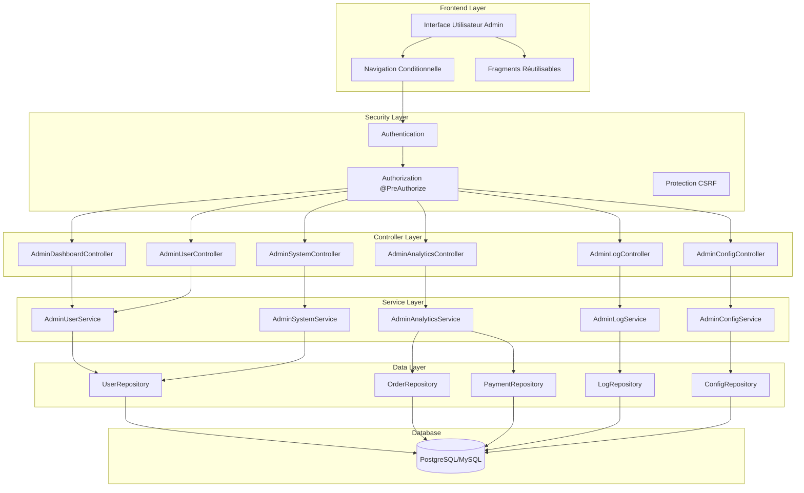
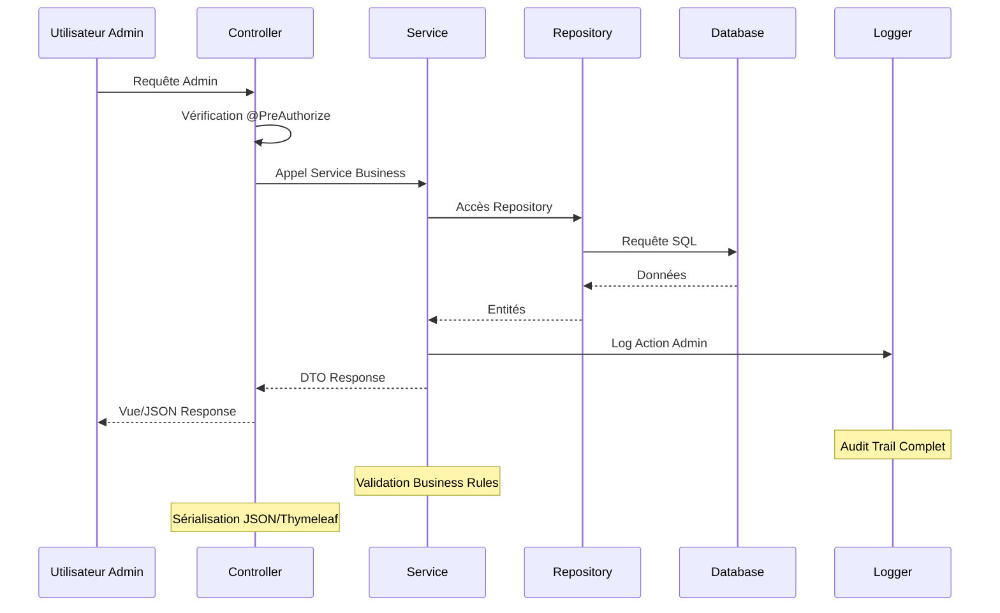
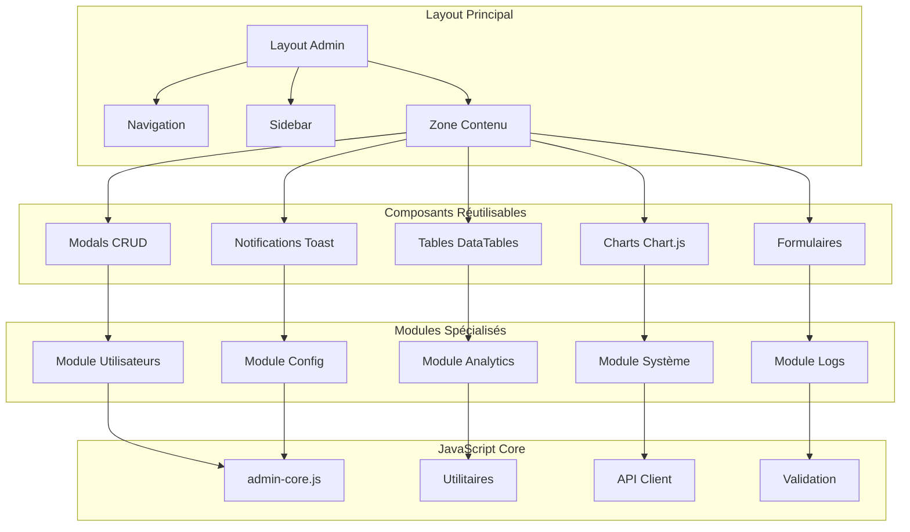
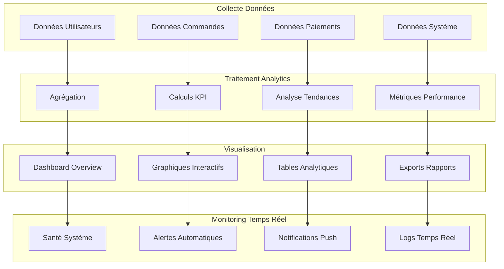
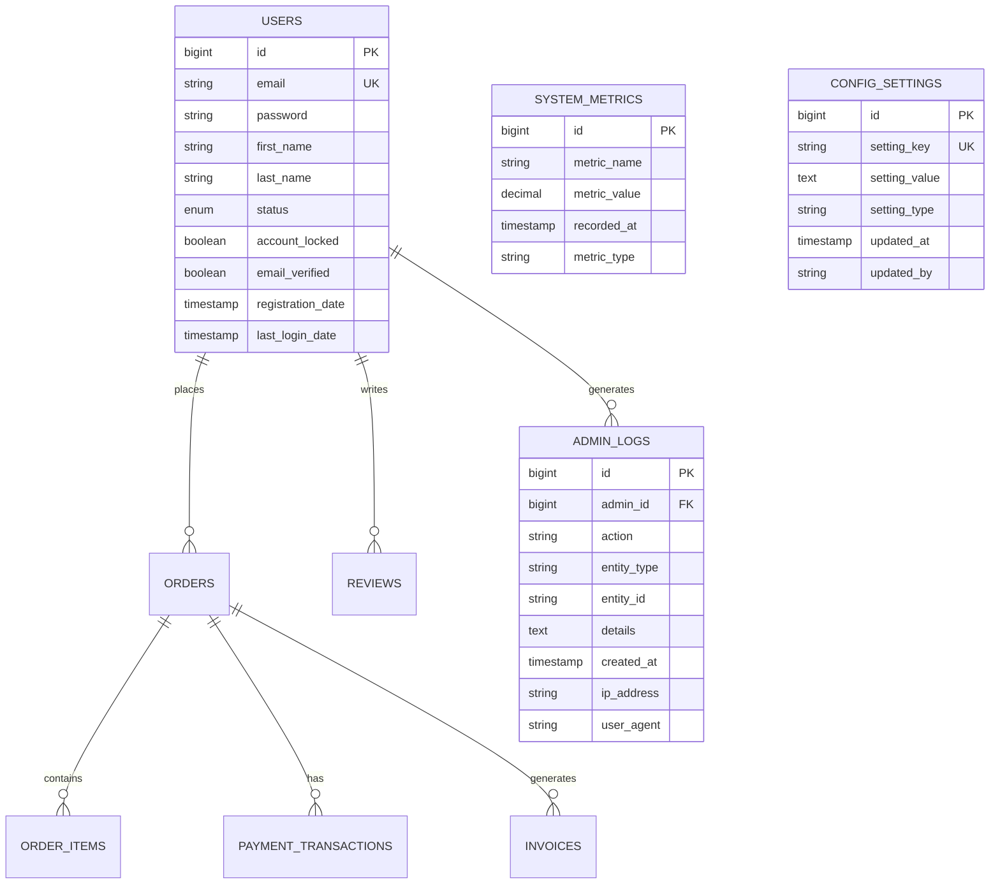
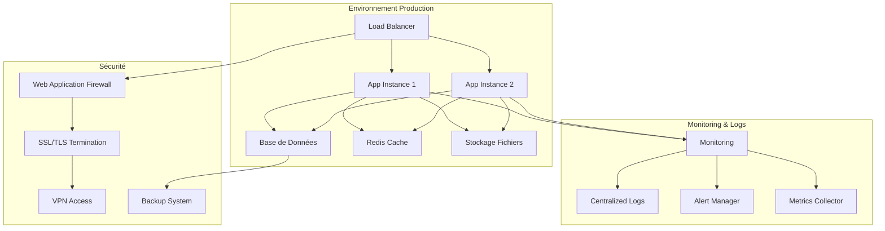

# Diagramme d'Architecture - Dashboard Administrateur LMP

## 🏗️ **Architecture Système Global**



## 🎯 **Architecture Modulaire Détaillée**

```mermaid
graph TB
    subgraph "PHASE 1 - Architecture Base"
        DTO[DTOs Admin]
        SERV[Services Base]
        FRAG[Fragments Thymeleaf]
        JS[Composants JavaScript]
        NOTIF[Système Notifications]
    end
    
    subgraph "PHASE 2 - Module Utilisateurs"
        UCRUD[CRUD Utilisateurs]
        UTABLE[Tables DataTables]
        UMODAL[Modals Gestion]
        UVALID[Validation Formulaires]
    end
    
    subgraph "PHASE 3 - Module Analytics"
        ANAL[Controllers Analytics]
        CHART[Graphiques Chart.js]
        KPI[Indicateurs KPI]
        EXPORT[Export Rapports]
    end
    
    subgraph "PHASE 4 - Module Monitoring"
        MONITOR[Monitoring Système]
        ALERT[Alertes Temps Réel]
        PERF[Métriques Performance]
        HEALTH[Santé Système]
    end
    
    subgraph "PHASE 5 - Module Logs"
        LOGS[Système Logs]
        SEARCH[Recherche Avancée]
        AUDIT[Trail Audit]
        ARCHIVE[Archivage]
    end
    
    subgraph "PHASE 6 - Module Configuration"
        CONFIG[Panneaux Config]
        PARAM[Gestion Paramètres]
        TOOLS[Outils Admin]
        BACKUP[Sauvegarde/Restauration]
    end
    
    DTO --> UCRUD
    SERV --> ANAL
    FRAG --> UTABLE
    JS --> CHART
    NOTIF --> ALERT
    
    UCRUD --> MONITOR
    UTABLE --> LOGS
    UMODAL --> CONFIG
    UVALID --> PARAM
```



## 🔄 **Flux de Données Admin**



## 🎨 **Architecture Frontend Modulaire**



## 🔐 **Architecture de Sécurité**

```mermaid
graph TB
    subgraph "Couche Authentification"
        LOGIN[Login Admin]
        SESSION[Session Management]
        ROLES[Rôles & Permissions]
    end
    
    subgraph "Couche Autorisation"
        PREAUTH[@PreAuthorize]
        RBAC[Role-Based Access Control]
        PERM[Permissions Granulaires]
    end
    
    subgraph "Protection Données"
        CSRF[Protection CSRF]
        XSS[Protection XSS]
        SQL[Protection SQL Injection]
        VALID[Validation Entrées]
    end
    
    subgraph "Audit & Logging"
        AUDIT[Audit Trail]
        MONITOR[Monitoring Sécurité]
        ALERT[Alertes Sécurité]
        RETENTION[Rétention Logs]
    end
    
    LOGIN --> SESSION
    SESSION --> ROLES
    ROLES --> PREAUTH
    PREAUTH --> RBAC
    RBAC --> PERM
    
    PERM --> CSRF
    CSRF --> XSS
    XSS --> SQL
    SQL --> VALID
    
    VALID --> AUDIT
    AUDIT --> MONITOR
    MONITOR --> ALERT
    ALERT --> RETENTION
```

## 📊 **Architecture Analytics & Monitoring**



## 🗄️ **Architecture Base de Données**



## 🚀 **Architecture de Déploiement**



## 🎯 **Points Clés de l'Architecture**

### **✅ Modularité**
- Chaque module est indépendant et réutilisable
- Interfaces claires entre les couches
- Séparation des responsabilités respectée

### **✅ Scalabilité**
- Architecture permettant la montée en charge
- Cache distribué avec Redis
- Load balancing des instances

### **✅ Sécurité**
- Contrôle d'accès granulaire
- Protection multi-couches
- Audit complet des actions

### **✅ Maintenabilité**
- Code bien structuré et documenté
- Tests automatisés complets
- Monitoring et alertes proactives

### **✅ Performance**
- Optimisations base de données
- Cache intelligent
- Chargement asynchrone frontend

Cette architecture modulaire permet une implémentation progressive tout en maintenant une cohérence globale et une excellente maintenabilité.