# Diagrammes d'Architecture - Vue Administration des Commandes

## 🏗️ Architecture Système Globale

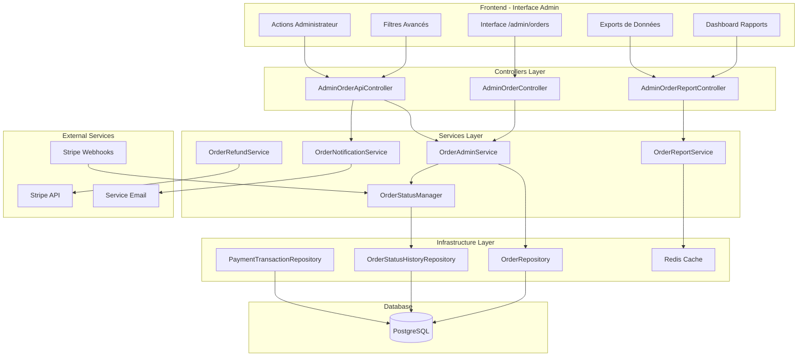

---

## 🔄 Flux de Gestion des Statuts avec Webhooks

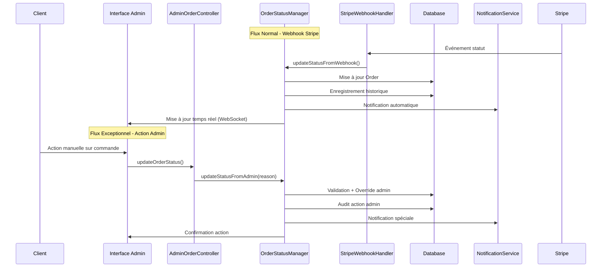

---

## 🎯 Architecture du Système de Filtrage

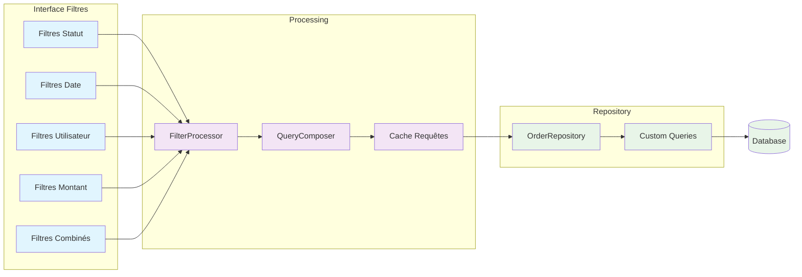

---

## 📧 Architecture du Système de Notifications

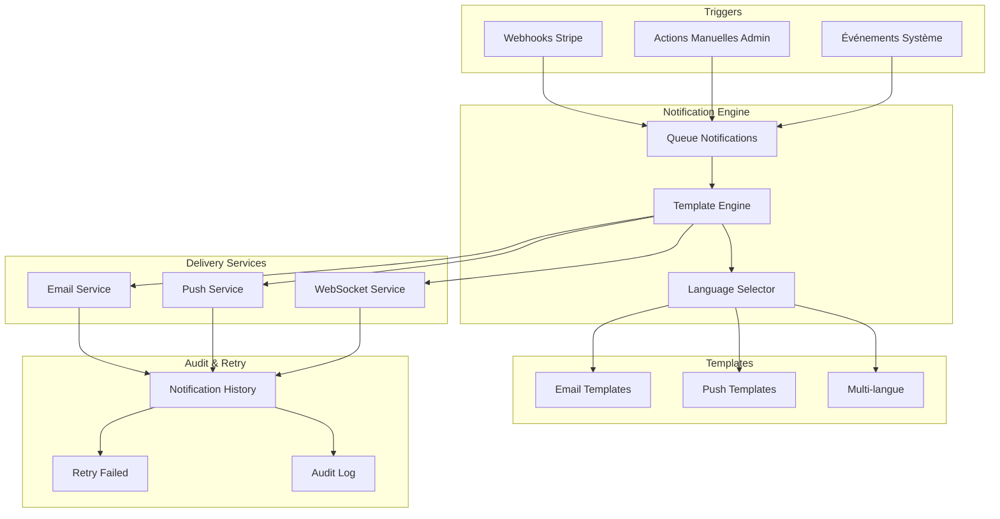

---

## 💰 Architecture du Système de Remboursements

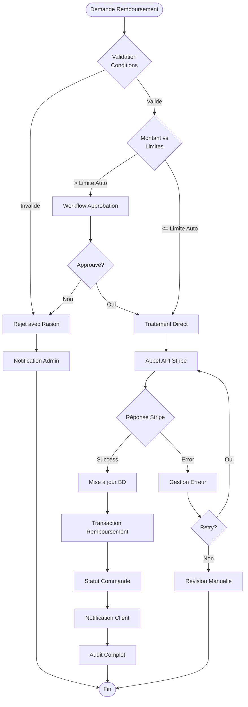

---

## 📊 Architecture des Rapports et Analytics

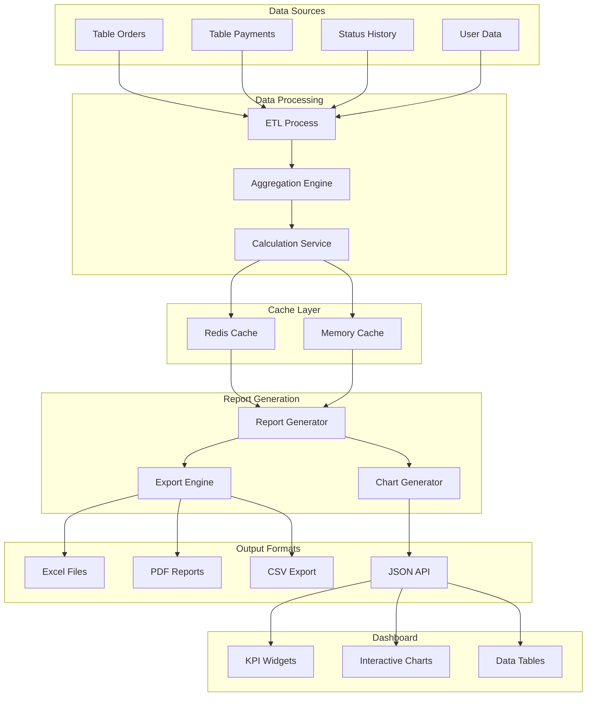

---

## 🔐 Architecture de Sécurité et Audit

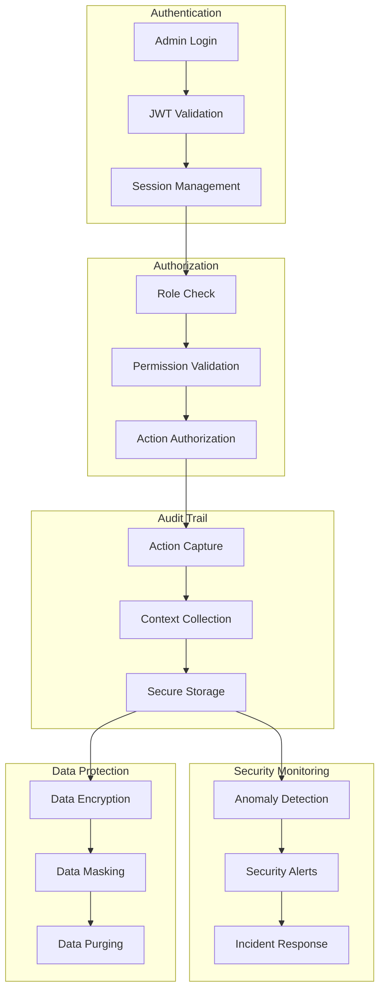

---

## 🔄 Flux de Données en Temps Réel

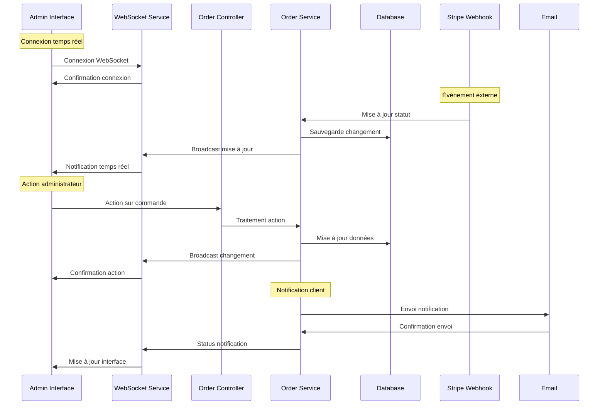

---

## 📱 Architecture Interface Utilisateur

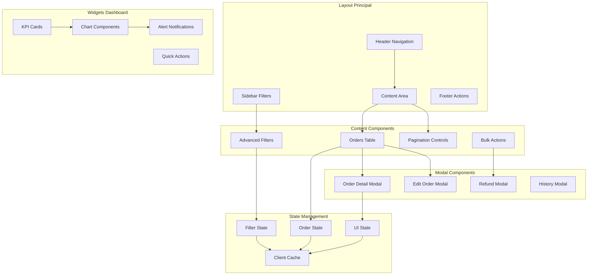

---

## 🚀 Architecture de Déploiement

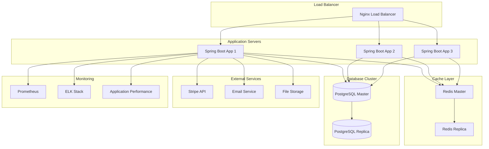

---

## 📊 Métriques et Performance

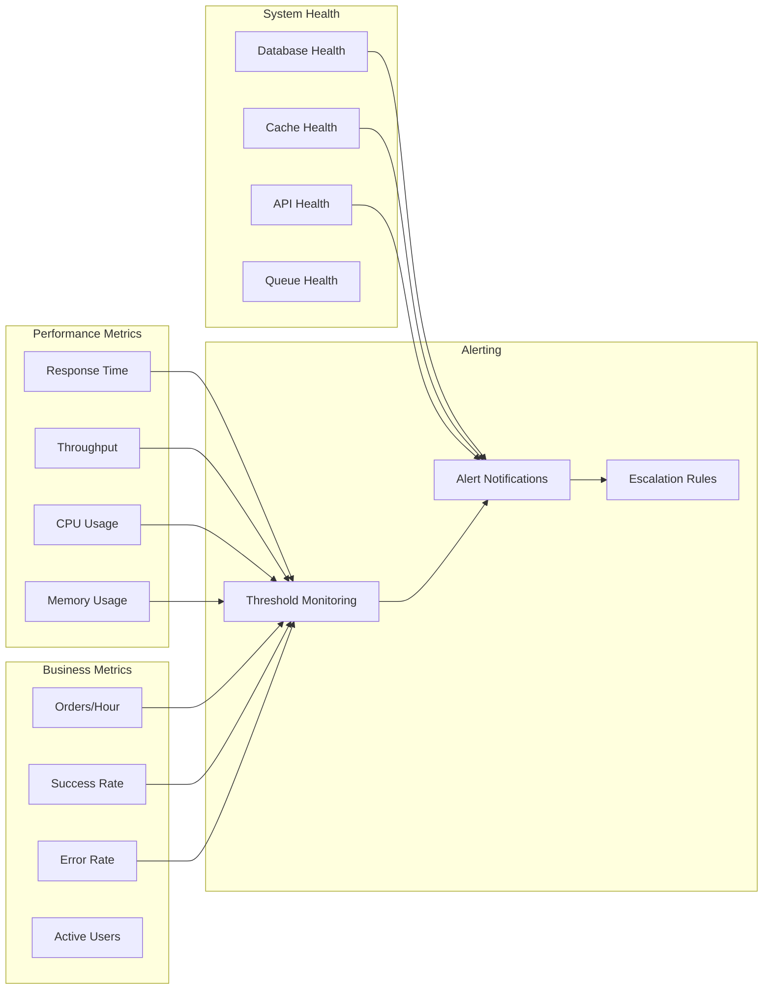

---

Ces diagrammes illustrent l'architecture complète du système de gestion des commandes administrateur, couvrant tous les aspects techniques et fonctionnels identifiés dans le plan d'architecture.