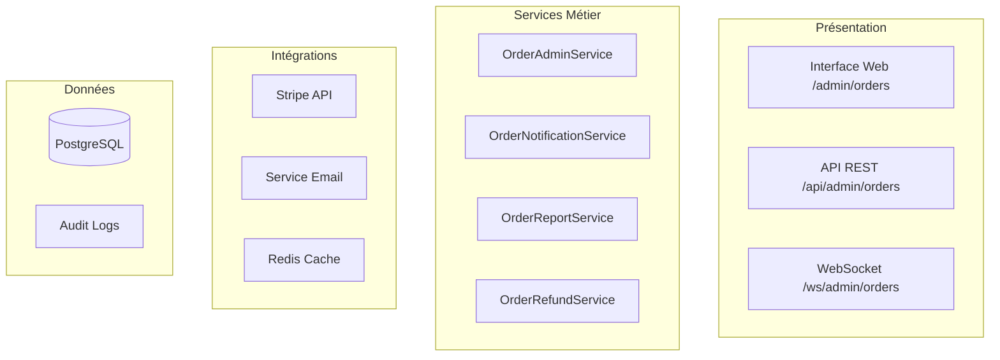

# Documentation Complète - Vue Administration des Commandes LMP Digital Services

## 📋 Table des Matières

1. [Vue d'Ensemble du Projet](#vue-densemble-du-projet)
2. [Architecture Technique](#architecture-technique)
3. [Fonctionnalités Implémentées](#fonctionnalités-implémentées)
4. [Guide d'Implémentation](#guide-dimplémentation)
5. [Plan de Déploiement](#plan-de-déploiement)
6. [Tests et Validation](#tests-et-validation)
7. [Maintenance et Support](#maintenance-et-support)
8. [Annexes](#annexes)

---

## 🎯 Vue d'Ensemble du Projet

### Contexte
LMP Digital Services nécessite une vue d'administration complète pour gérer les commandes de la plateforme. Cette solution doit inclure toutes les fonctionnalités avancées : gestion du cycle de vie complet des commandes, système de notifications, remboursements Stripe, rapports analytiques et exports de données.

### Objectifs
- **Primaire** : Fournir une interface administrative complète pour la gestion des commandes
- **Secondaire** : Automatiser les processus de notification et de remboursement
- **Tertiaire** : Offrir des outils d'analyse et de reporting avancés

### Périmètre Fonctionnel
✅ **Gestion complète des commandes** : Consultation, modification, annulation, suivi  
✅ **Filtrage et recherche avancés** : Multi-critères avec sauvegarde  
✅ **Actions administrateur** : Validation, modification, annulation avec historique  
✅ **Système de notifications** : Emails automatiques aux clients  
✅ **Gestion des remboursements** : Intégration Stripe complète  
✅ **Rapports et analytics** : Dashboard avec KPIs et graphiques  
✅ **Exports de données** : Excel, CSV, PDF avec planification  
✅ **Interface temps réel** : Mises à jour WebSocket  

### Contraintes Respectées
- **Webhooks Stripe** : Conservation du système automatique existant
- **Infrastructure** : Intégration harmonieuse avec Spring Boot et PostgreSQL
- **Sécurité** : Respect des permissions et audit complet
- **Performance** : Optimisation pour gros volumes de données

---

## 🏗️ Architecture Technique

### Stack Technologique
- **Backend** : Spring Boot 3.x, Spring Security, Spring Data JPA
- **Base de données** : PostgreSQL 13+ avec optimisations
- **Cache** : Redis pour performance
- **Frontend** : Thymeleaf, Bootstrap 5, JavaScript ES6+
- **Temps réel** : WebSocket avec STOMP
- **Intégrations** : Stripe API, Services Email

### Architecture en Couches



### Composants Principaux

#### Controllers
- **[`AdminOrderController`](admin-orders-implementation-guide.md#1-adminordercontroller)** : Interface principale Thymeleaf
- **[`AdminOrderApiController`](admin-orders-implementation-guide.md#2-adminorderapicontroller)** : API REST pour AJAX
- **[`AdminOrderReportController`](admin-orders-implementation-guide.md)** : Génération rapports et exports

#### Services
- **[`OrderAdminService`](admin-orders-technical-specifications.md#1-orderadminservice)** : Logique métier principale
- **[`OrderNotificationService`](admin-orders-technical-specifications.md#2-ordernotificationservice)** : Notifications clients
- **[`OrderReportService`](admin-orders-technical-specifications.md)** : Analytics et rapports
- **[`OrderRefundService`](admin-orders-technical-specifications.md)** : Gestion remboursements

#### DTOs
- **[`OrderAdminDto`](admin-orders-technical-specifications.md#1-orderadmindto)** : Données enrichies pour l'admin
- **[`OrderFilterDto`](admin-orders-technical-specifications.md#2-orderfilterdto)** : Critères de recherche
- **[`OrderActionDto`](admin-orders-technical-specifications.md#3-orderactiondto)** : Actions administrateur

---

## 🎯 Fonctionnalités Implémentées

### 1. Interface de Gestion Principale

#### Consultation des Commandes
- **Tableau paginé** avec colonnes : ID, Client, Statut, Montant, Dates
- **Tri interactif** par toutes les colonnes
- **Pagination optimisée** (20/50/100 items par page)
- **Indicateurs visuels** pour statuts et problèmes

#### Filtrage Avancé
- **Filtres par statut** : Multi-sélection avec badges colorés
- **Filtres temporels** : Presets (aujourd'hui, semaine, mois) et personnalisés
- **Recherche client** : Nom, email avec autocomplétion
- **Filtres montant** : Plages prédéfinies et personnalisées
- **Sauvegarde filtres** : Réutilisation de requêtes complexes

### 2. Actions Administrateur

#### Gestion des Statuts
- **Transitions validées** : Respect du workflow métier
- **Override administrateur** : Possibilité de forcer avec justification
- **Historique complet** : Audit trail de tous les changements
- **Notifications automatiques** : Respect des webhooks Stripe

#### Actions Spécialisées
- **Annulation commandes** : Avec raison obligatoire et notification
- **Ajout de notes** : Historique horodaté des interventions admin
- **Modification détails** : Montants et informations avec validation

### 3. Système de Notifications

#### Emails Automatiques
- **Templates personnalisables** : Par statut et langue
- **Envoi asynchrone** : Queue avec retry automatique
- **Historique notifications** : Suivi des envois réussis/échoués
- **Variables dynamiques** : Données commande et client

#### Notifications Temps Réel
- **WebSocket** : Mises à jour interface en temps réel
- **Indicateurs visuels** : Nouvelles commandes et changements
- **Multi-onglets** : Synchronisation entre sessions

### 4. Gestion des Remboursements

#### Intégration Stripe
- **Remboursements partiels/complets** : Interface de saisie validée
- **Workflow d'approbation** : Pour montants élevés
- **Historique financier** : Suivi des transactions
- **Notifications clients** : Confirmation automatique

#### Validation et Sécurité
- **Contrôles métier** : Montants disponibles et conditions
- **Audit complet** : Logs sécurisés de toutes les actions
- **Permissions granulaires** : Autorisation par rôle

### 5. Analytics et Rapports

#### Dashboard KPIs
- **Métriques temps réel** : Commandes, revenus, conversions
- **Graphiques interactifs** : Chart.js avec drill-down
- **Alertes automatiques** : Commandes nécessitant attention
- **Comparaisons périodiques** : Évolutions et tendances

#### Génération de Rapports
- **Rapports ventes** : Analyses temporelles détaillées
- **Rapports clients** : Top clients et comportements
- **Rapports financiers** : Revenus, remboursements, frais
- **Planification automatique** : Envoi périodique par email

### 6. Exports de Données

#### Formats Multiples
- **Excel** : Mise en forme professionnelle avec graphiques
- **CSV** : Données brutes pour analyses externes
- **PDF** : Rapports officiels avec en-têtes personnalisés

#### Fonctionnalités Avancées
- **Exports personnalisés** : Sélection colonnes et critères
- **Exports volumineux** : Traitement asynchrone
- **Historique exports** : Re-téléchargement et suivi

---

## 🛠️ Guide d'Implémentation

### Phase 1 : Préparation (1 semaine)

#### Setup Environnement
```bash
# Dépendances Maven à ajouter
- spring-boot-starter-websocket
- spring-boot-starter-data-redis
- poi-ooxml (Excel)
- itext7-core (PDF)
```

#### Configuration Database
```sql
-- Index optimisés pour performance
CREATE INDEX idx_orders_status_created ON orders(status, created_at);
CREATE INDEX idx_orders_user_status ON orders(user_id, status);
CREATE INDEX idx_orders_amount_range ON orders(total_amount);
```

#### Configuration Redis
```yaml
spring:
  redis:
    host: localhost
    port: 6379
    timeout: 2000ms
    lettuce:
      pool:
        max-active: 10
        max-wait: -1ms
```

### Phase 2 : Backend Core (2 semaines)

#### Étape 1 : DTOs et Entities
1. Créer [`OrderAdminDto`](admin-orders-technical-specifications.md#1-orderadmindto) avec toutes les propriétés
2. Implémenter [`OrderFilterDto`](admin-orders-technical-specifications.md#2-orderfilterdto) avec validation
3. Développer [`OrderActionDto`](admin-orders-technical-specifications.md#3-orderactiondto) pour actions

#### Étape 2 : Services Métier
1. [`OrderAdminService`](admin-orders-technical-specifications.md#1-orderadminservice) avec toutes les méthodes
2. Extension [`OrderRepository`](admin-orders-technical-specifications.md#1-extension-orderrepository) avec requêtes optimisées
3. [`OrderNotificationService`](admin-orders-technical-specifications.md#2-ordernotificationservice) avec templates

#### Étape 3 : Controllers
1. [`AdminOrderController`](admin-orders-implementation-guide.md#1-adminordercontroller) pour interface web
2. [`AdminOrderApiController`](admin-orders-implementation-guide.md#2-adminorderapicontroller) pour API REST
3. Gestion erreurs et validation complète

### Phase 3 : Frontend (2 semaines)

#### Templates Thymeleaf
1. [`index.html`](admin-orders-implementation-guide.md#1-template-principal-indexhtml) - Interface principale
2. [`order-table.html`](admin-orders-implementation-guide.md#3-fragment-tableau-order-tablehtml) - Tableau avec actions
3. [`order-filters.html`](admin-orders-implementation-guide.md#2-fragment-filtres-order-filtershtml) - Filtres avancés

#### JavaScript Frontend
1. [`orders-management.js`](admin-orders-implementation-guide.md#1-gestion-principale-orders-managementjs) - Logique principale
2. `orders-filters.js` - Gestion filtres et recherche
3. `orders-websocket.js` - Temps réel WebSocket

#### Styles et UX
1. CSS responsive avec Bootstrap 5
2. Animations et feedbacks utilisateur
3. Accessibilité WCAG complète

### Phase 4 : Intégrations (1.5 semaines)

#### Stripe Integration
```java
@Service
public class StripeRefundService {
    public RefundResponse processRefund(Long orderId, BigDecimal amount) {
        // Intégration API Stripe pour remboursements
        // Gestion erreurs et retry
        // Audit et notifications
    }
}
```

#### Email Templates
```html
<!-- Template Thymeleaf pour notifications -->
<div th:fragment="order-status-update">
    <h2>Mise à jour de votre commande #<span th:text="${orderId}"></span></h2>
    <p>Bonjour <span th:text="${customerName}"></span>,</p>
    <p>Votre commande est maintenant : <strong th:text="${newStatus}"></strong></p>
</div>
```

#### WebSocket Configuration
```java
@Configuration
@EnableWebSocket
public class WebSocketConfig implements WebSocketConfigurer {
    @Override
    public void registerWebSocketHandlers(WebSocketHandlerRegistry registry) {
        registry.addHandler(new OrderUpdateHandler(), "/ws/admin/orders")
                .setAllowedOrigins("*");
    }
}
```

### Phase 5 : Tests et Validation (1 semaine)

#### Tests Unitaires
```java
@SpringBootTest
class OrderAdminServiceTest {
    @Test
    void shouldUpdateOrderStatusWithValidTransition() {
        // Test des transitions de statut autorisées
        // Validation historique et audit
        // Vérification notifications
    }
}
```

#### Tests d'Intégration
```java
@SpringBootTest
@AutoConfigureTestDatabase
class AdminOrderControllerIntegrationTest {
    @Test
    void shouldFilterOrdersByStatusAndDate() {
        // Test filtrage complet avec BDD
        // Validation pagination et tri
        // Performance avec gros volumes
    }
}
```

#### Tests E2E
```javascript
// Cypress ou Selenium
describe('Admin Orders Management', () => {
    it('should filter and manage orders', () => {
        // Test parcours complet utilisateur
        // Actions CRUD sur commandes
        // Validation notifications et exports
    });
});
```

---

## 🚀 Plan de Déploiement

### Environnements

#### Développement
- **Base** : PostgreSQL locale avec données test
- **Cache** : Redis local
- **Emails** : MailCatcher pour tests
- **Stripe** : Mode sandbox complet

#### Staging
- **Réplication production** : Données anonymisées
- **Tests performance** : Volumes réalistes
- **Validation utilisateur** : Tests d'acceptation
- **Monitoring** : Métriques complètes

#### Production
- **High Availability** : Cluster PostgreSQL
- **Redis Cluster** : Pour haute performance
- **CDN** : Assets statiques optimisés
- **Monitoring** : Alertes temps réel

### Migration Plan

#### Phase 1 : Préparation
1. **Backup complet** des données existantes
2. **Migration schema** BDD avec nouveaux index
3. **Configuration** environnement production
4. **Tests smoke** infrastructure

#### Phase 2 : Déploiement
1. **Déploiement application** en mode maintenance
2. **Migration données** si nécessaire
3. **Tests fonctionnels** rapides
4. **Mise en service** progressive

#### Phase 3 : Validation
1. **Tests utilisateur** avec équipe admin
2. **Monitoring** performance et erreurs
3. **Ajustements** configuration si nécessaire
4. **Formation** équipe administrative

### Rollback Strategy
```bash
# Script de rollback automatisé
#!/bin/bash
echo "Starting rollback to previous version..."
kubectl rollout undo deployment/lmp-admin-orders
kubectl rollout status deployment/lmp-admin-orders
echo "Rollback completed successfully"
```

---

## 🧪 Tests et Validation

### Stratégie de Tests

#### Tests Unitaires (80% coverage)
- **Services** : Logique métier complète
- **Repositories** : Requêtes et performance
- **DTOs** : Validation et mapping
- **Utilitaires** : Formatage et calculs

#### Tests d'Intégration (Composants)
- **Controllers** : Endpoints et sérialisation
- **Services intégrés** : Avec BDD et cache
- **Email/Stripe** : Mocks et sandbox
- **WebSocket** : Connexions et messages

#### Tests E2E (Parcours critiques)
- **Gestion commandes** : CRUD complet
- **Filtrage avancé** : Tous les critères
- **Notifications** : Envoi et réception
- **Exports** : Génération et téléchargement

### Critères d'Acceptation

#### Performance
- **Temps de réponse** : < 2s pour toutes les actions
- **Pagination** : < 1s pour 10k+ commandes
- **Exports** : < 30s pour 50k records
- **WebSocket** : < 100ms latence

#### Fonctionnel
- **Couverture** : 100% des user stories
- **Ergonomie** : Score SUS > 80
- **Fiabilité** : 0% perte de données
- **Compatibilité** : Chrome/Firefox/Safari

#### Sécurité
- **Authentification** : 2FA requis pour actions critiques
- **Autorisation** : Permissions granulaires respectées
- **Audit** : 100% des actions loggées
- **Chiffrement** : HTTPS et données sensibles

---

## 🔧 Maintenance et Support

### Monitoring Production

#### Métriques Techniques
```yaml
# Prometheus metrics
- http_requests_total{endpoint="/admin/orders"}
- database_query_duration_seconds{query="orders_search"}
- redis_cache_hit_rate{cache="orders"}
- websocket_connections_active
```

#### Métriques Business
- **Utilisation** : Actions par admin par jour
- **Performance** : Temps traitement commandes
- **Qualité** : Taux erreur notifications
- **Satisfaction** : Feedback utilisateurs

#### Alertes Automatiques
```yaml
alerts:
  - name: OrdersResponseTimeSlow
    condition: avg(http_request_duration) > 2s
    action: notify_dev_team
  
  - name: OrdersErrorRateHigh
    condition: rate(http_errors) > 0.05
    action: page_oncall
```

### Support Utilisateurs

#### Documentation
- **Guide utilisateur** : Screenshots et vidéos
- **FAQ** : Questions fréquentes
- **Troubleshooting** : Résolution problèmes courants
- **API Reference** : Pour intégrations

#### Formation
- **Sessions initiales** : Prise en main interface
- **Formations avancées** : Rapports et analytics
- **Webinaires** : Nouvelles fonctionnalités
- **Support continu** : Canal Slack dédié

### Évolutions Futures

#### Roadmap Technique
- **IA/ML** : Détection anomalies commandes
- **Mobile** : App native pour administrateurs
- **API publique** : Intégrations tierces
- **Automatisation** : Workflows avancés

#### Fonctionnalités Business
- **Prédictions** : Analyses prédictives ventes
- **Segmentation** : Groupes clients avancés
- **A/B Testing** : Tests interface admin
- **Intégrations** : ERP/CRM externes

---

## 📚 Annexes

### A. Configuration Complète

#### application.yml
```yaml
lmp:
  admin:
    orders:
      pagination:
        default-size: 20
        max-size: 100
      cache:
        enabled: true
        ttl: 300s
        max-size: 1000
      websocket:
        enabled: true
        heartbeat-interval: 30s
        max-connections: 100
      notifications:
        enabled: true
        async: true
        retry-attempts: 3
        templates-path: classpath:templates/emails/
      exports:
        enabled: true
        max-records: 50000
        temp-directory: /tmp/lmp-exports
        cleanup-after: 24h
      security:
        require-2fa: true
        session-timeout: 30m
        max-failed-attempts: 5
```

### B. Scripts SQL

#### Index Optimisés
```sql
-- Performance indexes for orders management
CREATE INDEX CONCURRENTLY idx_orders_admin_search 
ON orders(status, created_at DESC, total_amount);

CREATE INDEX CONCURRENTLY idx_orders_user_lookup 
ON orders(user_id) INCLUDE (status, total_amount, created_at);

CREATE INDEX CONCURRENTLY idx_orders_status_history 
ON order_status_history(order_id, created_at DESC);

-- Full-text search for user names and emails
CREATE INDEX CONCURRENTLY idx_users_search 
ON users USING gin(to_tsvector('french', first_name || ' ' || last_name || ' ' || email));
```

#### Vues Analytiques
```sql
-- Vue pour dashboard analytics
CREATE OR REPLACE VIEW v_orders_analytics AS
SELECT 
    DATE(created_at) as date,
    status,
    COUNT(*) as order_count,
    SUM(total_amount) as total_revenue,
    AVG(total_amount) as avg_order_value
FROM orders 
WHERE created_at >= NOW() - INTERVAL '90 days'
GROUP BY DATE(created_at), status
ORDER BY date DESC, status;
```

### C. Templates Email

#### Notification Changement Statut
```html
<!DOCTYPE html>
<html xmlns:th="http://www.thymeleaf.org">
<head>
    <meta charset="UTF-8">
    <title>Mise à jour de votre commande</title>
</head>
<body>
    <div style="max-width: 600px; margin: 0 auto; padding: 20px;">
        <h2>Mise à jour de votre commande #<span th:text="${orderId}">12345</span></h2>
        
        <p>Bonjour <span th:text="${customerName}">Client</span>,</p>
        
        <p>Nous vous informons que le statut de votre commande a été mis à jour :</p>
        
        <div style="background: #f8f9fa; padding: 15px; border-radius: 5px; margin: 20px 0;">
            <strong>Nouveau statut :</strong> <span th:text="${newStatusDisplay}">En cours</span>
        </div>
        
        <div th:if="${statusMessage}" style="margin: 20px 0;">
            <p th:text="${statusMessage}">Message personnalisé</p>
        </div>
        
        <hr style="margin: 30px 0;">
        
        <h3>Détails de votre commande</h3>
        <ul>
            <li><strong>Numéro :</strong> #<span th:text="${orderId}">12345</span></li>
            <li><strong>Montant :</strong> <span th:text="${orderAmount}">100,00</span> CAD</li>
            <li><strong>Date :</strong> <span th:text="${#temporals.format(orderDate, 'dd/MM/yyyy')}">01/01/2024</span></li>
        </ul>
        
        <div style="margin: 30px 0; text-align: center;">
            <a th:href="${dashboardUrl}" 
               style="background: #007bff; color: white; padding: 12px 24px; text-decoration: none; border-radius: 5px;">
                Voir ma commande
            </a>
        </div>
        
        <div style="margin-top: 40px; padding-top: 20px; border-top: 1px solid #dee2e6; font-size: 14px; color: #6c757d;">
            <p>Pour toute question, contactez notre support : <a th:href="'mailto:' + ${supportEmail}" th:text="${supportEmail}">support@lmp-digital.ca</a></p>
            <p>LMP Digital Services<br>
               Votre partenaire pour la transformation numérique</p>
        </div>
    </div>
</body>
</html>
```

### D. Checklist Déploiement

#### Pre-Deployment
- [ ] Tests complets passés (unit, integration, E2E)
- [ ] Code review et approval
- [ ] Documentation mise à jour
- [ ] Backup base de données effectué
- [ ] Configuration production validée
- [ ] Plan de rollback testé

#### Deployment
- [ ] Mode maintenance activé
- [ ] Déploiement application
- [ ] Migration base de données si nécessaire
- [ ] Configuration cache Redis
- [ ] Tests smoke réussis
- [ ] Monitoring activé

#### Post-Deployment
- [ ] Tests fonctionnels validés
- [ ] Performance vérifiée
- [ ] Logs de déploiement archivés
- [ ] Équipe admin notifiée
- [ ] Documentation support mise à jour
- [ ] Retour utilisateur collecté

---

Cette documentation complète fournit tous les éléments nécessaires pour implémenter, déployer et maintenir la vue d'administration des commandes avec toutes les fonctionnalités avancées demandées pour LMP Digital Services.