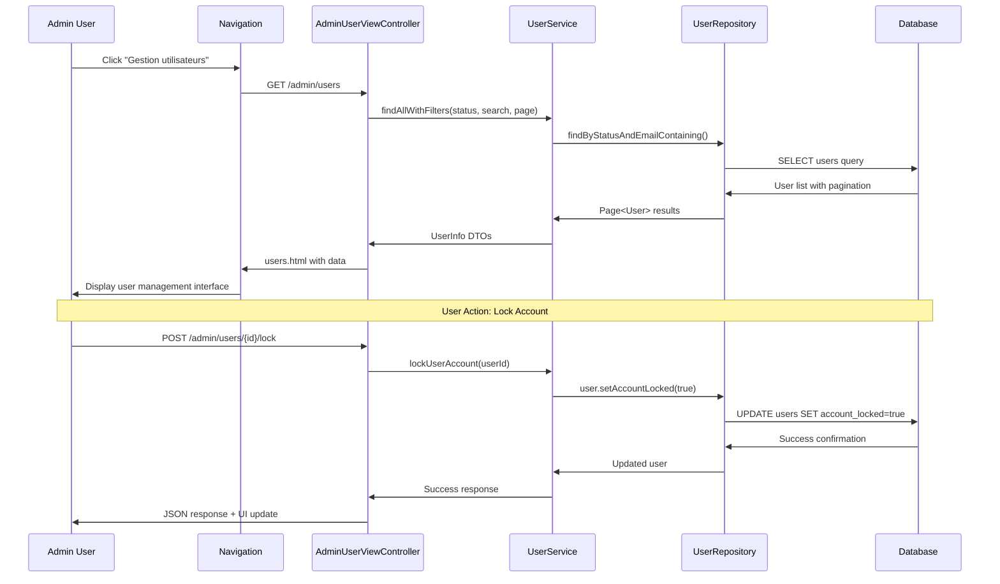
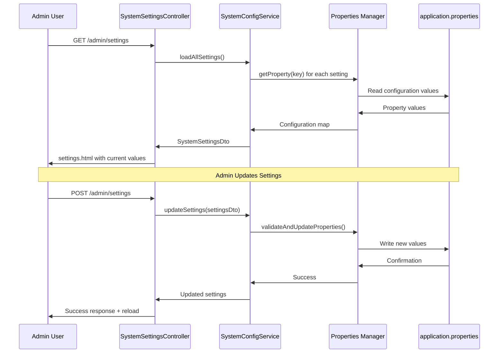
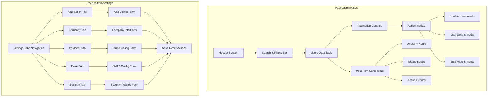
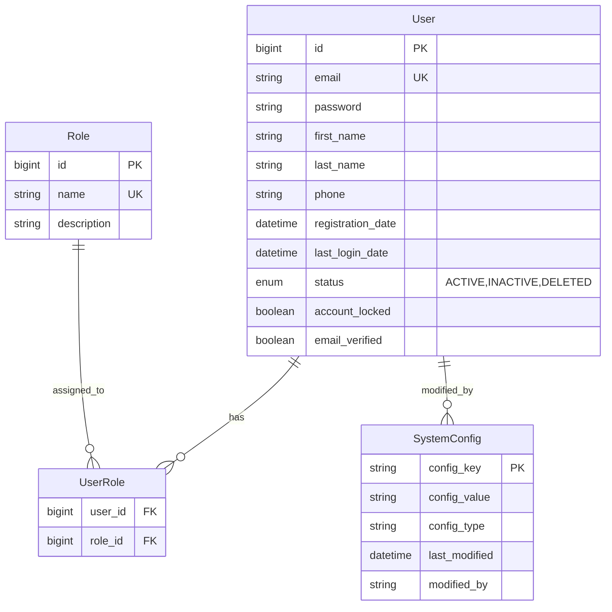

# Diagramme d'Architecture - Vues d'Administration

## 🏗️ Vue d'Ensemble de l'Architecture

```mermaid
graph TB
    subgraph "Frontend Admin"
        A[Navigation Admin] --> B[/admin/dashboard]
        A --> C[/admin/users]
        A --> D[/admin/settings]
        
        B --> B1[AdminDashboardController]
        C --> C1[AdminUserViewController]
        D --> D1[SystemSettingsController]
    end
    
    subgraph "Controllers Layer"
        B1 --> B2[dashboard.html]
        C1 --> C2[users.html]
        D1 --> D2[settings.html]
        
        C1 --> C3[UserService]
        D1 --> D3[SystemConfigService]
    end
    
    subgraph "Service Layer"
        C3 --> C4[UserRepository]
        D3 --> D4[application.properties]
        
        C3 --> C5[User Management Logic]
        D3 --> D5[Config Management Logic]
    end
    
    subgraph "Data Layer"
        C4 --> C6[MySQL Database]
        D4 --> D7[Configuration Files]
        
        C6 --> C8[users table]
        C6 --> C9[user_roles table]
    end
    
    subgraph "Security Layer"
        S1[Spring Security] --> S2[@PreAuthorize ADMIN]
        S2 --> B1
        S2 --> C1
        S2 --> D1
    end
```

## 🔄 Flux de Données - Gestion Utilisateurs



## 🛠️ Flux de Données - Paramètres Système



## 📁 Structure des Fichiers

```
src/main/java/com/lmp/
├── web/controller/admin/
│   ├── AdminDashboardController.java     ✅ Existant
│   ├── UserManagementController.java     ✅ Existant (API REST)
│   ├── AdminUserViewController.java      🆕 Vue Gestion Users
│   └── SystemSettingsController.java     🆕 Vue Paramètres
├── service/
│   ├── user/UserService.java            ✅ Existant
│   └── system/SystemConfigService.java   🆕 Gestion Config
├── web/dto/admin/
│   ├── UserActionDto.java                🆕 Actions utilisateur
│   └── SystemSettingsDto.java           🆕 Paramètres système
└── domain/entity/
    └── User.java                         ✅ Existant

src/main/resources/templates/admin/
├── dashboard.html                        ✅ Existant
├── users.html                           🆕 Interface Users
├── settings.html                        🆕 Interface Settings
└── fragments/
    ├── admin-layout.html                🆕 Layout commun
    ├── user-table.html                  🆕 Tableau users
    ├── user-actions.html                🆕 Actions users
    └── settings-form.html               🆕 Formulaire config
```

## 🎨 Architecture des Composants UI



## 🔒 Modèle de Sécurité

```mermaid
graph LR
    subgraph "Security Flow"
        A[Request] --> B[Spring Security Filter]
        B --> C{User Authenticated?}
        C -->|No| D[Redirect to Login]
        C -->|Yes| E{Has ADMIN Role?}
        E -->|No| F[403 Forbidden]
        E -->|Yes| G[Controller Access Granted]
        
        G --> H[@PreAuthorize Check]
        H --> I[Method Execution]
        I --> J[Response]
    end
    
    subgraph "Admin Endpoints"
        G --> K[AdminDashboardController]
        G --> L[AdminUserViewController] 
        G --> M[SystemSettingsController]
        
        L --> N[User Management Actions]
        M --> O[System Configuration]
        
        N --> P[Audit Logging]
        O --> P
    end
```

## 📊 Modèle de Données



## 🎯 Points d'Intégration

### 1. Navigation Existante
```html
<!-- Dans admin/dashboard.html -->
<li class="nav-item">
    <a class="nav-link" th:href="@{/admin/users}">
        <i class="fas fa-users me-1"></i>
        Utilisateurs
    </a>
</li>
<li class="nav-item">  
    <a class="nav-link" th:href="@{/admin/settings}">
        <i class="fas fa-cogs me-1"></i>
        Paramètres
    </a>
</li>
```

### 2. API REST Existante
```java
// Déjà disponible dans UserManagementController
@GetMapping("/api/admin/users")
public ResponseEntity<List<UserInfo>> getAllUsers()

// À étendre pour actions CRUD
@PostMapping("/api/admin/users/{id}/lock")
@PostMapping("/api/admin/users/{id}/unlock")
@PostMapping("/api/admin/users/{id}/activate")
```

### 3. Services Existants
```java
// UserService déjà disponible
@Autowired
private UserService userService;

// Nouvelles méthodes à ajouter
public void lockUser(Long userId);
public void unlockUser(Long userId);
public Page<User> findUsersWithFilters(UserFilter filter, Pageable pageable);
```

## 📋 Check-list d'Implémentation

### Phase 1: Infrastructure
- [ ] Créer `AdminUserViewController.java`
- [ ] Créer `SystemSettingsController.java`  
- [ ] Créer `SystemConfigService.java`
- [ ] Créer DTOs pour actions et paramètres

### Phase 2: Vues HTML
- [ ] Développer `users.html` avec tableau et filtres
- [ ] Développer `settings.html` avec onglets et formulaires
- [ ] Créer fragments réutilisables
- [ ] Intégrer avec layout existant

### Phase 3: Fonctionnalités
- [ ] Implémenter actions utilisateur (lock/unlock/activate)
- [ ] Implémenter gestion des paramètres système
- [ ] Ajouter validation et gestion d'erreurs
- [ ] Intégrer avec sécurité Spring

### Phase 4: UX/UI
- [ ] Actions AJAX pour réactivité
- [ ] Feedback utilisateur (toasts/alerts)
- [ ] Pagination et recherche
- [ ] Responsive design

### Phase 5: Tests & Validation
- [ ] Tests unitaires des controllers
- [ ] Tests d'intégration des vues
- [ ] Tests de sécurité
- [ ] Validation manuelle interface

Cette architecture s'appuie sur l'infrastructure existante tout en ajoutant les fonctionnalités demandées avec une approche modulaire et maintenable.