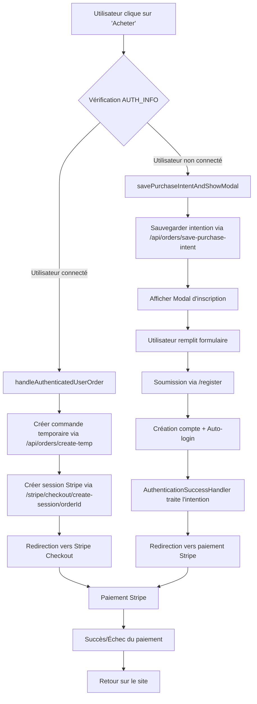
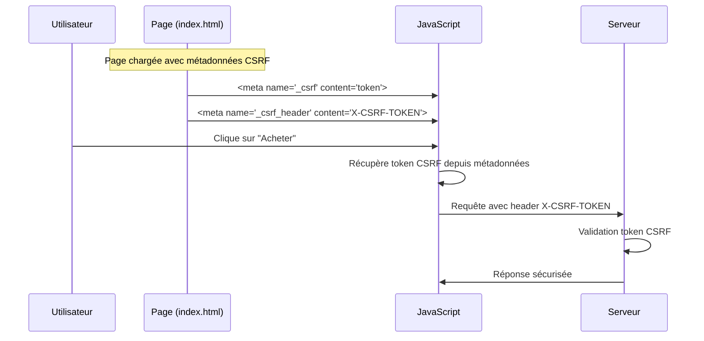
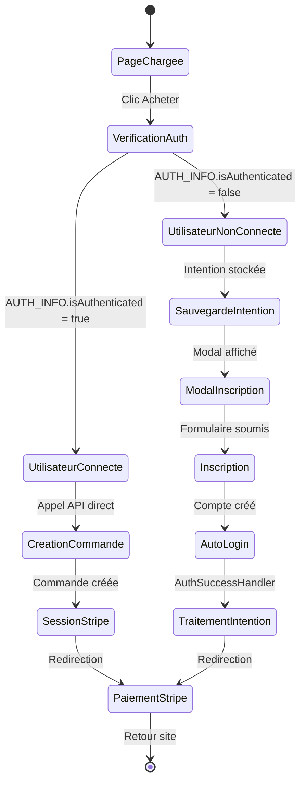
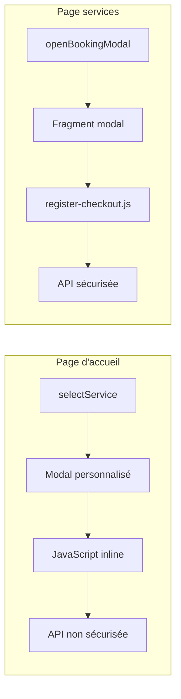
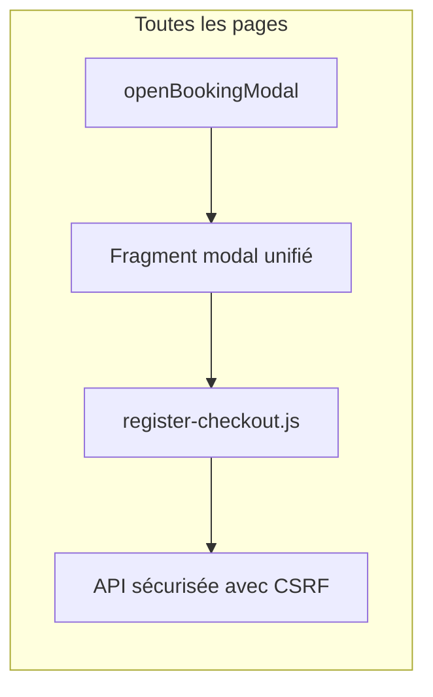
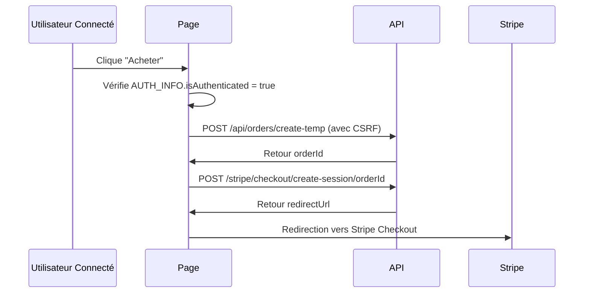
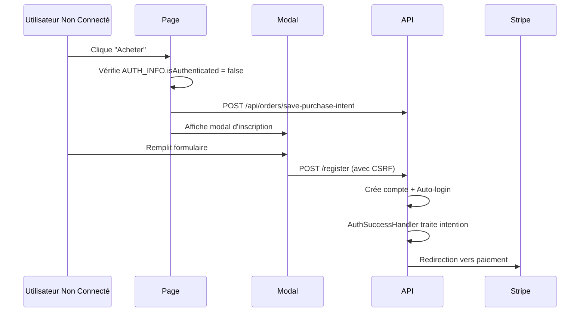
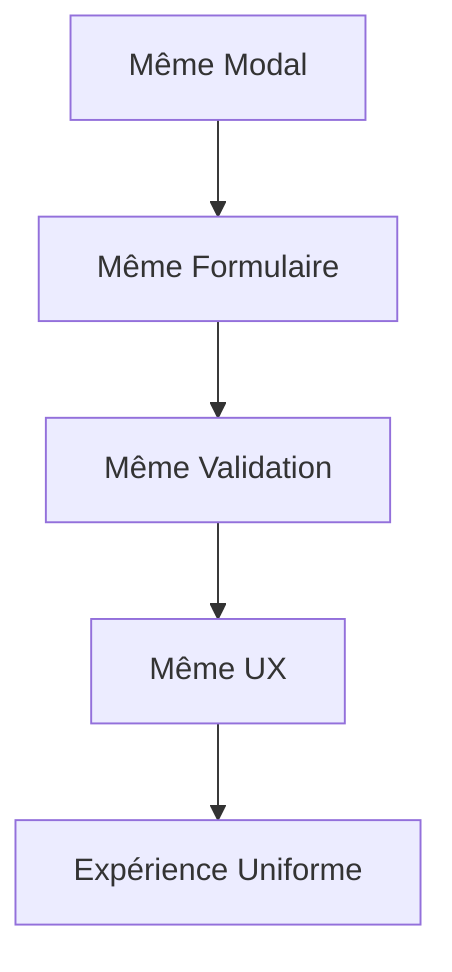
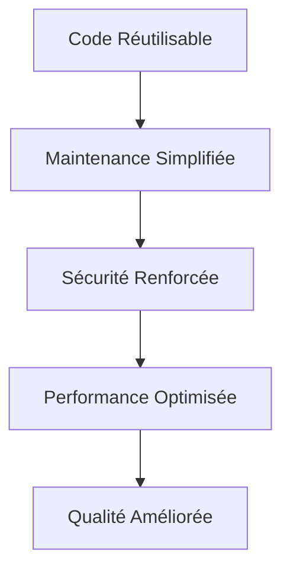

# Diagramme de Flux - Architecture Unifiée d'Achat

## 🔄 Flux d'Achat Unifié



## 🏗️ Architecture des Composants

```mermaid
graph TB
    subgraph "Pages Web"
        HP[index.html - Page d'accueil]
        SP[services.html - Page services]
    end
    
    subgraph "Composants Partagés"
        BM[fragments/booking-modal.html]
        RC[register-checkout.js]
        CSRF[Métadonnées CSRF]
        AUTH[Window.AUTH_INFO]
    end
    
    subgraph "APIs Backend"
        REG[/register - Inscription]
        TEMP[/api/orders/create-temp]
        INTENT[/api/orders/save-purchase-intent]
        STRIPE[/stripe/checkout/create-session]
    end
    
    HP --> BM
    SP --> BM
    HP --> RC
    SP --> RC
    HP --> CSRF
    SP --> CSRF
    HP --> AUTH
    SP --> AUTH
    
    RC --> REG
    RC --> TEMP
    RC --> INTENT
    RC --> STRIPE
```

## 🔐 Flux de Sécurité CSRF



## 🎯 États et Transitions



## 📱 Composants Unifiés

### Avant l'Unification


### Après l'Unification


## 🧪 Scénarios de Test

### Test 1: Utilisateur Connecté


### Test 2: Utilisateur Non Connecté


## 🎨 Avantages Visuels de l'Unification

### Cohérence Interface


### Architecture Technique


## 📋 Points de Validation

### Sécurité ✅
- [ ] Tokens CSRF présents sur toutes les pages
- [ ] Validation AUTH_INFO fonctionnelle
- [ ] Protection contre les attaques CSRF
- [ ] Gestion sécurisée des sessions

### Fonctionnalité ✅
- [ ] Flux identique page d'accueil / services
- [ ] Modal unifié fonctionne partout
- [ ] Gestion d'erreurs cohérente
- [ ] Redirections correctes

### Performance ✅
- [ ] Script externalisé chargé une fois
- [ ] Fragments réutilisés efficacement
- [ ] Pas de duplication de code
- [ ] Optimisation des requêtes

### UX/UI ✅
- [ ] Interface cohérente entre pages
- [ ] Comportement prévisible
- [ ] Messages d'erreur uniformes
- [ ] Transitions fluides

Cette architecture unifiée garantit une expérience d'achat cohérente, sécurisée et maintenir sur l'ensemble du site LMP.