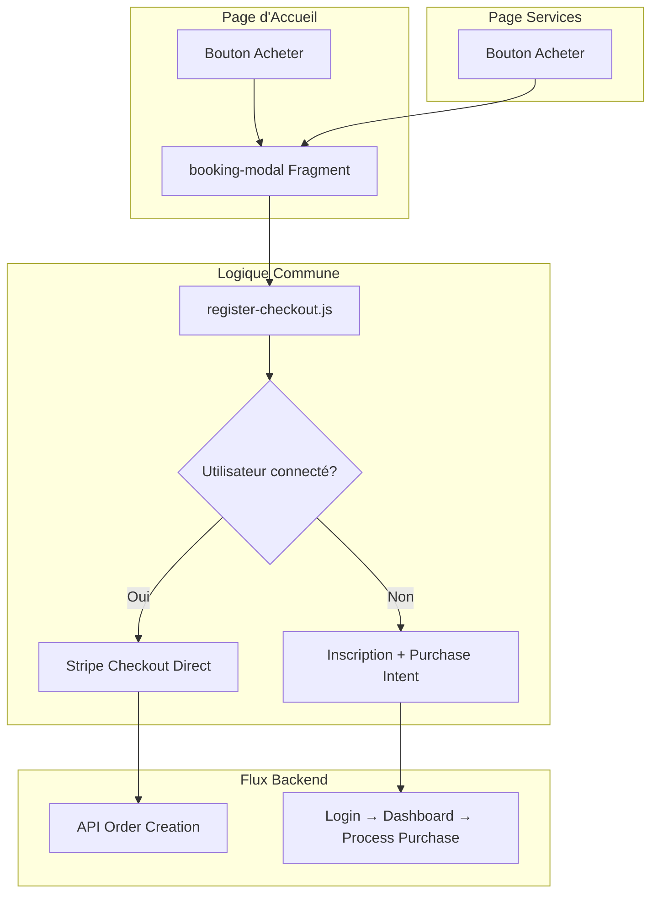

# Plan de Correction - Unification de la Logique d'Achat

## 🎯 **Problème Identifié**

**Incohérence entre les pages d'accueil et services :**

### **Page d'Accueil (`index.html`)**
```javascript
// Logique actuelle - SIMPLE
selectService(serviceName, price) → paymentModal → processPayment()
↓
createOrderAndInitiatePayment() → API directe
```

### **Page Services (`services.html`)**
```javascript
// Logique actuelle - SOPHISTIQUÉE
openBookingModal(serviceName, price) → booking-modal → register-checkout.js
↓
Gestion authentification + redirection intelligente
```

---

## 🔧 **Solution Recommandée : Adopter la Logique Services**

La page services a la **logique la plus robuste** avec :
- ✅ Gestion de l'authentification utilisateur
- ✅ Redirection intelligente selon le statut
- ✅ Script `/js/register-checkout.js` optimisé
- ✅ Modal `booking-modal` réutilisable
- ✅ CSRF token management

### **Action Required : Modifier `index.html`**

## 📋 **Plan de Correction**

### **Étape 1 : Harmoniser les Boutons d'Achat**

**Remplacer dans `index.html` :**
```html
<!-- AVANT -->
<button onclick="selectService('Service Name', 123.45)" class="...">
    Acheter
</button>

<!-- APRÈS -->
<button onclick="openBookingModal('Service Name', 123.45)" class="...">
    Acheter
</button>
```

### **Étape 2 : Ajouter les Dépendances Manquantes**

**Dans `index.html`, ajouter :**
```html
<!-- CSRF Token pour les appels API -->
<meta name="_csrf" th:content="${_csrf.token}"/>
<meta name="_csrf_header" th:content="${_csrf.headerName}"/>

<!-- Authentication Info for JavaScript -->
<script th:inline="javascript">
    window.AUTH_INFO = {
        isAuthenticated: /*[[${#authorization.expression('isAuthenticated()')}]]*/ false,
        currentUser: /*[[${#authentication.name}]]*/ null
    };
</script>
```

### **Étape 3 : Inclure les Fragments et Scripts**

**Remplacer dans `index.html` :**
```html
<!-- AVANT : Modal payment custom -->
<div id="paymentModal" class="...">
    <!-- Modal custom simple -->
</div>

<!-- APRÈS : Fragment réutilisable -->
<div th:replace="fragments/booking-modal :: booking-modal"></div>

<!-- Include Register Checkout Script -->
<script src="/js/register-checkout.js"></script>
```

### **Étape 4 : Nettoyer l'Ancien Code JavaScript**

**Supprimer de `index.html` :**
- `selectService()` function
- `paymentModal` related functions
- `processPayment()` function
- `createOrderAndInitiatePayment()` function

---

## 🔄 **Architecture Unifiée Résultante**



---

## 📝 **Modifications Détaillées**

### **1. Fichier `index.html` - Modifications Requises**

#### **A. Ajouter les Meta Tags (après ligne 8)**
```html
<!-- CSRF Token pour les appels API -->
<meta name="_csrf" th:content="${_csrf.token}"/>
<meta name="_csrf_header" th:content="${_csrf.headerName}"/>

<!-- Authentication Info for JavaScript -->
<script th:inline="javascript">
    window.AUTH_INFO = {
        isAuthenticated: /*[[${#authorization.expression('isAuthenticated()')}]]*/ false,
        currentUser: /*[[${#authentication.name}]]*/ null
    };
</script>
```

#### **B. Modifier tous les boutons "Acheter" (lignes 142, 168, 194, 220, 246, 272, 298, 324)**
```html
<!-- REMPLACER -->
onclick="selectService('Service Name', price)"

<!-- PAR -->
onclick="openBookingModal('Service Name', price)"
```

#### **C. Remplacer le Payment Modal (lignes 435-456)**
```html
<!-- SUPPRIMER l'ancien paymentModal -->

<!-- AJOUTER AVANT la fermeture de </body> -->
<div th:replace="fragments/booking-modal :: booking-modal"></div>
<script src="/js/register-checkout.js"></script>
```

#### **D. Nettoyer le JavaScript (lignes 497-606)**
```javascript
// SUPPRIMER ces fonctions :
// - selectService()
// - openPaymentModal() 
// - closePaymentModal()
// - processPayment()
// - createOrderAndInitiatePayment()

// GARDER ces fonctions :
// - toggleMobileMenu()
// - scrollToSection()
// - scrollToContact()
// - openBookingModal()
// - closeBookingModal()
// - handleEmailSubmit()
// - handleBookingSubmit()
```

---

## 🎯 **Bénéfices de l'Unification**

### **✅ Cohérence Utilisateur**
- Même expérience d'achat sur toutes les pages
- Interface utilisateur unifiée
- Comportement prévisible

### **✅ Robustesse Technique**
- Gestion d'authentification centralisée
- CSRF protection sur toutes les pages
- Gestion d'erreurs cohérente

### **✅ Maintenabilité**
- Code JavaScript réutilisable
- Fragment Thymeleaf partagé
- Une seule logique à maintenir

### **✅ Fonctionnalités Avancées**
- Purchase intent pour utilisateurs non connectés
- Redirection intelligente post-inscription
- Gestion des états d'authentification

---

## 🚀 **Validation du Correctif**

### **Tests à Effectuer Après Modification**

1. **Page d'accueil - Utilisateur connecté**
   - Clic "Acheter" → Modal booking → Paiement direct

2. **Page d'accueil - Utilisateur non connecté** 
   - Clic "Acheter" → Modal booking → Inscription → Login → Purchase intent

3. **Page services - Utilisateur connecté**
   - Clic "Acheter" → Modal booking → Paiement direct

4. **Page services - Utilisateur non connecté**
   - Clic "Acheter" → Modal booking → Inscription → Login → Purchase intent

5. **Cohérence des interfaces**
   - Même modal sur les deux pages
   - Même comportement JavaScript
   - Même gestion d'erreurs

---

## ⚡ **Implémentation Immédiate**

### **Priorité 1 : Modification `index.html`**
1. Ajouter meta tags CSRF et AUTH_INFO
2. Changer tous les `selectService()` en `openBookingModal()`
3. Remplacer paymentModal par fragment booking-modal
4. Inclure script register-checkout.js
5. Nettoyer l'ancien JavaScript

### **Priorité 2 : Tests de Validation**
1. Tester achat page d'accueil (connecté/non connecté)
2. Tester achat page services (connecté/non connecté)
3. Vérifier cohérence des comportements
4. Valider les redirections et purchase intents

Cette unification garantit une expérience utilisateur cohérente et robuste sur l'ensemble du site.